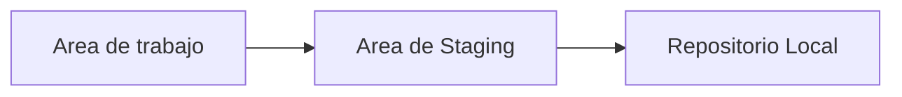
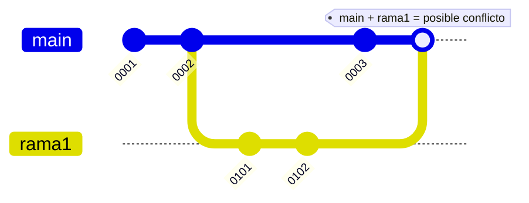
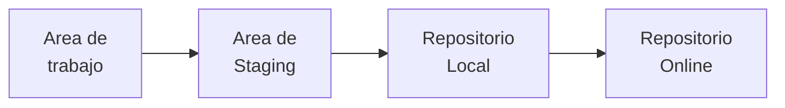

# GIT & GITHUB

## Configuración inicial

- existen distintos scopes de configuración, local, global, y system.

Podemos acceder a las mismas con el comando 
`git config --(local/global/system)`

`--local`  realiza cambios para ese repositorio en particular
`--global`  realiza cambios para todos los repos en ese equipo.
`--system`  realiza cambios para todo el sistema.

 limpiar consola git
`clear`

 ver la lista de configuraciones globales
`git config --global --list`

configurando el nombre global de usuario en git
`git config --global user.name "Davidejemplo"`

configurando mail
`git config --global user.email "davidseba.giordano@gmail.com"`


Configurar el editor(visual studio code) para mensajes
`git config --global core.editor "code --wait"`
`(visual studio code)  --(esto genera que se confirmen los cambios cuando se cierre el editor de codigos)`

configurar colores de interfaz
`git config --global color.ui true`


importante para evitar problemas a futuro con el texto (funciona solo en windows)
`git config --global core.autocrlf true (carriage return line feed)`

configurar para que la versiòn abreviada del hash de cada commit, sea de x dígitos (normalmente 10)
`git config --global core.abbrev X`

---

### info adicional
[How do i force git to use lf instead of crlf](https://stackoverflow.com/questions/2517190/how-do-i-force-git-to-use-lf-instead-of-crlf-under-windows/13154031#13154031)

---

## Repositorios
### comandos basicos del shell

`cd (nombre entrar carpeta)` 	: entrar a una carpeta.

`cd ../` 				:(volver para atrás un nivel en el directorio) (es lo mismo poner cd ..)

`mkdir (nombre de carpeta)`	:(crea una carpeta en el directorio actual)

`rmdir (nombre de la carpeta)`	:(borra una carpeta del directorio actual con el nombre)

`rm (nombre del archivo)`		:(remueve el archivo indicado localmente)

`dir`				:(lista contenido de directorio actual)

`ls`				:(lista de archivos)

`ls -l`				:(lista de archivos como lista efectiva)

`ls -lh`				:(lista de archivos)

`touch (nombre de archivo.ext)`	:(crear un archivo nuevo)

`cp (nombre del archivo a copiar) (nombre del directorio donde queremos copiarlo)`   :copia archivos

`mv (directorio del archivo/nombre de archivo.ext) (directorio a donde queremos mover el archivo)` :mueve archivos

`rm -r (nombre de la carpeta a eliminar, junto con sus archivos)` : (elimina archivos y carpetas todo junto




---

## INICIALIZAR EL REPOSITORIO LOCAL

`git init`  (esto inicializa la carpeta como repositorio local)

### Agregar archivos al area de STAGING

 `git add .`  (agrega TODOS los archivos de la carpeta al area de staging)

 `git add (nombre del archivo uno por uno)`

ejemplo:

 ``` git add index.html image.jpg readme.txt```


### Ver estado de la carpeta, commits, etc del repo. (muestra qué archivo se va a subir al repo)

`git status`

### Sacar archivo del area de STAGING

`git rm --cached (nombre del archivo)`

`git restore --staged (nombre del archivo EN EL area de staging que queremos SACAR)`

`git reset`  :elimina todos los archivos del area de staging

---
### Realizar Commit 

`git commit -m "(mensaje de actualización en el commit)"`  : (-m permite agregar mensaje al commit).

`git commit` :(esto abre automáticamente el editor de texto configurado antes, para escribir en
 	detalle los datos del commit)`

### Realizar Commit --- Sin pasar por el área de STAGING ---

`git commit -a`

### Ver Datos y Hash De Los Commits

`git log` 

`git log --oneline`  :(muestra el log y los hash resumidos configurados de los commits)

`git log --oneline --all`  :(muestra los commits de TODAS las ramas)

`git ls-tree -r --name-only (hash resumido del commit a ver)` :(muestra lista de  archivos y carpetas en ese commit)
`git ls-tree -r --name-only HEAD` :(esto refiere al último commit disponible)

### Eliminar un archivo del repo

`rm (archivo)`  :se elimina el archivo.
luego, se debe agregar la "eliminación del archivo" con `git add (nombre de archivo o punto)` 
finalmente se realiza el commit.		
`git commit -m "(mensaje)" -a`

### RESTAURAR UN ARCHIVO ELIMINADO LOCALMENTE DESDE EL REPO

`git restore (ruta/nombre del archivo.ext)` :(esto restaura un archivo borrado localmente al punto de la última actualización que tuvo el mismo en el repo. si se hicieron cambios
luego del commit y no se guardaron, no van a estar en el archivo restaurado)


### VOLVER ATRÁS EL ESTADO DE UN ARCHIVO, al último commit actualizado(HEAD).(esto no funciona si hay cambios subidos al ÁREA DE STAGING)
### GIT Revert

`Git revert` es similar a git reset, pero el enfoque es ligeramente diferente. En lugar de eliminar todos los commit a su paso, la reversión SÓLO deshace un único commit, devolviéndote a los archivos organizados antes del commit.

Así, en lugar de eliminar un commit, git revert invierte los cambios introducidos por el commit original creando un nuevo commit con el contenido inverso subyacente. Esta es una forma segura de revocar un commit porque evita que pierdas tu historial. 

`git revert HEAD`
el código anterior, genera un NUEVO COMMIT, posterior al actual, con los cambios generados en este commit actual desestimados. O sea, elimina los cambios introducidos en el commit actual, pero creando un nuevo commmit "hacia adelante"


`git revert --no-edit <commit ID>`
La opción --no-edit permite al usuario no cambiar el mensaje utilizado para el commit que desea revertir, y esto hará que git revierta el archivo a la rama maestra.


----

`git revert <commit hash>`
Esto sólo eliminará los cambios asociados a este hash de commit y no afectará a ningún otro commit. incluso funciona si por ej. se han eliminado archivos en un commit anterior, al revertir ese commit, se recuperan los archivos.

---

`git revert --no-comit <commit ID>  || [git revert -n <commit ID>]`
este comando revertirá los cambios del commit indicado, pero no creará un nuevo commit, para que se puedan verificar y decidir si se commitean asi como están o se agregan más cambios.


## Ramas / Branches

**T**ener en cuena que depende de en qué rama estemos posicionado, al crear una nueva rama, puede no ser del proyecto principal


`git branch`  (esto muestra todas las ramas activas y creadas del repo)

`git branch  (nombre de la rama)`  :esto crea una rama(copia del estado actual) con el nombre indicado.

`git branch -a` : muestra todas las **ramas locales** disponibles.

`git branch -r` : muestra todas las **ramas locales y remotas registradas** (OJO! pueden haber referencias a ramas que ya no existen más remotamente.)

>[!warning] para actualizar esas referencias que quizás están erróneas, se usa 
`git fetch --prune`


#### CAMBIAR A UNA RAMA
`git checkout (nombre de la rama en la que se quiere trabajar)` (ya no se suele utilizar)

`git switch (nombre de la rama en la que se quiere trabajar)`

Crear una rama y cambiar a esa inmediatamente:
`git switch -c (nomber de la rama a crear)` 


#### ELIMINAR RAMAS 

>ES IMPORTANTE QUE PARA ELIMINAR UNA RAMA, NO DEBEMOS ESTAR PARADOS EN ELLA


Eliminar rama
`git branch -d (nombre de la rama a borrar)`

Cambiar Nombre de Rama
`git branch -m (nombre actual de la rama) (nombre nuevo de la rama)`
> NO DEBEMOS ESTAR PARADOS SOBRE LA RAMA A MODIFICAR EL NOMBRE


Cambiar Nombre de la Rama Actual
`git branch -m (nuevo nombre a colocar en la rama actual)`

Eliminar una Rama Remota desde Git
`git push origin --delete [rama_a_borrar]`

#### UNIR RAMAS (MERGE o FUSIONAR)

>IMPORTANTE! para fusionar **RAMA1** con **RAMA2**, debemos estar "parados" en la rama a la cual queremos "mantener". En este caso, debemos estar en **RAMA1** y fusionar **RAMA2** con **RAMA1**, para que los cambios se agreguen a **RAMA1**.

FUSIONAR RAMAS:
`git merge [nombre de la rama a fusionar con la actual]`

==EN CASO DE HABERSE EQUIVOCADO:==

`git reset --hard (HASH del último commit de la rama principal antes de fusionar las ramas)`

ESTO ELIMINA EL COMMIT DE FUSION DE LAS RAMAS pero
no la rama que se fusionó!
EN EL CASO DE QUERER RECUPERAR UN COMMIT BORRADO CON RESET --HARD, si tenemos el HASH de referencia, podemos recuperarlo con

`git reset --hard (HASH del commit borrado)`

#### CONFLICTOS DE FUSIONADO (MERGE) 

Esto suele suceder cuando se trabaja en una rama, desde un punto B de la rama principal, y antes de fusionar la rama con el principal, se da que la rama principal tuvo modificaciones. 




Abriendo el editor de Visual Studio Code permite seleccionar qué código va a quedar seleccionado y se realiza el commit desde ahi directamente.
Se pueden aceptar cambios de una rama, de otra, ambas, o seleccionando la opción más conveniente de cada una.

Caso contrario, se pone:

`git merge --continue   (esto finaliza con el commit del merging)`

VER la última actualización de cada rama

`git branch -v`

### EN CASO DE QUE FIGURE EN EL MERGE NO MERGIN UNRELATED HISTORIES(esto es cuando varia demasiado las ramas)

`git merge [nombre de la rama a fusionar con la actual] --allow-unrelated-histories`

 esto abre el editor para resolver codigo o dejar el mensaje de commit del merging
 
 ---
 

### .GITIGNORE 

 esto define qué archivos GIT debe ignorar al momento de buscar para commitear. y solo funciona para archivos que **NUNCA** se han guardado en un commit, si el archivo ya se subió se crea un archivo .gitignore

se puede abrir con el VSC y se puede comentar dentro con el símbolo #(comentario)
se agrega el `[nombre.ext]` del archivo a ignorar, pero se puede definir por rangos
  	ej: *.txt / *.jpg / *.py
   
para excepcionar un archivo dentro del grupo de archivos definidos por ej en *.txt, se pone
 `![nombre de archivo.txt]`
  
Para ignorar un directorio completo se pone
`[nombre de carpeta]/`

CONFIGURAR QUE LOS REPOS LEAN UN ARCHIVO .GITIGNORE general:

  	git config --global core.excludesfile [ruta en la pc del archivo]
 	ej: git config --global core.excludesfile c:/generalfiles/.gitignore_global

  
---

#### ALIAS EN GIT
Se definen como funciones que guardan todos los comandos determinados para ejecutar más simple

 ej:
  ` git log --oneline --graph --all`
  	
se puede resumir configurando lo siguiente: elijiendo el nombre del comando propio como log simple

`git config --global alias.[nombre del comando propio] "log --oneline --graph --all"`

esto genera que al escribir
`c:> git logsimple` 
esto genere que se dispare el comando configurado anteriormente.

Ver la lista de alias asignado:
`git config --global --list |grep alias`

---

#### GIT REFLOG
  	esto es un log de todos los movimientos generados en el repo, borrados, HASH de elementos borrados, etc.
 

---
  
## GIT HUB (Repositorios Remotos) 




### CREAR Y CONFIGURAR REPOSITORIO REMOTO

#### GIT CLONE

Abrir el VSC dentro de la carpeta actual.
  `c:>CODE .`     

ESTANDO en la carpeta donde queremos copiar el repositorio por HTTPS, copiamos la dirección http y luego:

`git clone [dirección https del repositorio a clonar] ↩️`
  
>Esto ya configura el remote origin, para el push y fetch

#### GIT PUSH

Para poder subir archivos a nuestro repo, debemos tener configurado el mismo mail con el que iniciamos sesión
en Github. 
Luego, si queremos subir algo a un repo "clonado", se utiliza el comando

 `git push origin main`
 `git push [nombre del repo remoto] [rama del repo remoto]`
  	
Si esto abre una ventana de log, lo recomendable es hacerlo por [TOKEN]. Para obtener el [TOKEN],
 vamos a Settings > Developer Settings > Personal Acces Tokens > Tokens (classic) y ahi Generar nuevo token

Recomendaciones sobre el token
- No debería ser eterno. Lo recomendable es de 7 a 30 días.
- Los permisos con la primera opción, REPO ya es suficiente.

 Esto generará un código que se debe copiar en el sistema de inicio de sesión de Github por la solapa TOKEN.
* Para subir todas las ramas de tu repo local al remoto
`git push --all`

* Para subir al repo remoto _OnlineRepo_ con una rama remota _ramaR_ (distinto nombre de la rama remota a la rama local) tu rama local _ramaL_:

`git push OnlineRepo ramaL:ramaR`

 
#### GIT PULL

Utiliza para descargar CAMBIOS de archivos actualizados subidos al repo online. 
Esto es un **git fetch** y luego hacer un **git merge** todo junto.

`git pull [nombre_repo_remoto] [rama_remota]`
`Git pull origin main`

#### Hacer un GIT PULL de una rama en origin/ramaA la cual no existe en el repo local, y guardarla en una rama nueva.

Para poder hacer un pull de una rama remota la cual no existe en nuestro repositorio local, debemos crear una **rama nueva** en el **repo local**, y podemos hacer el **git pull** automáticamente creando y descargando la misma con el comando:
`git switch -c [rama_local] [origin]/[rama_remota_a_hacer_track]`

esto crearía en nuestro repo local, una "rama_local", y se descargaría la rama remota desde origin/"rama_remota_a_hacer_track"


#### Configurar un repo remoto limpio luego de tener un repo local con commits

- Primer, ya teniendo los commits en el repo local, creamos el repo remoto, y en git usamos
`git remote add origin [direccion http del repo remoto]`

luego hacemos un fetch de lo que tiene el repo remoto.
`git fetch`

- esto crea una descarga en una rama temporal llamada ***fetch_HEAD***, entonces podemos mergear esa rama temporal con el main nuestro:
parados en nuestra rama local a fusionar, usamos

  `git merge fetch_HEAD --allow-unrelated-histories` dado que no hay una relacion entre los commits.

y esto nos abre el editor de mensajes de commits, para poner un mensaje. al finalizar, tendremos las ramas vinculadas.

finalmente, hacemos un git push

`git push --set-upstream origin main`

#### ERRORES con git push

   There are two ways of solving the fatal: refusing to merge unrelated histories error

   `git pull origin main --allow-unrelated-histories`

 * You can substitute origin with the remote repository you are pulling from. You can also replace the master branch with whatever branch you want the pull request to merge into.

### Option 2: unstage, stash, clone, unstash, and then commit

The alternative (and longer) way of fixing the fatal: refusing to merge unrelated histories issues is to unstage your current commits, stash them, clone your required remote repository, and then place your stashed branch contents into the new clone.

This will ensure that any conflicts that you may encounter in the code are addressed before merging and prevent application errors from occurring.
To unstage all the files in your last commit, use the following git command: git reset HEAD~.

To stash your unsaved files, use the following git command: git stash.

This will give you a clean working tree to pull your remote repository into. Once you’ve successfully pulled into your branch, you can unstash your files, commit them as a separate commit and resolve any file conflicts that you may have.

To unstash your files, use git pop. This will move the changes stashed and reapplies them to your current working copy.

Alternatively, you can use git stash apply to add the changes to your current working copy of code.

Here is a quick summary of differences between git stash apply and <code”>git pop:

  `git pop`: ‘pops’ the changes from the stash and applies them to the current code
  `git stash apply`: keeps the changes in the stash and applies the changes to the current code

The easiest way to prevent the fatal: refusing to merge unrelated histories error is to avoid pulling remote repositories into branches that already have commits on them.

However, sometimes you just want to keep the commits. One way to prevent the error is to create a brand new branch, pull your required code in, and then manually merge your local branch into your main flow.


## GIT STASH (guardar temporalmente los cambios realizados en el area de trabajo sin commitear)

`git stash save "(MENSAJE PARA EL STASH-como un commit)"` 

* Esto guarda los cambios y revierte el directorio de trabajo a como se veía en tu último commit. Los cambios guardados están disponibles en cualquier rama de ese repositorio.

### Ver los cambios guardados en el stash:

 `git stash list`

* Esto devuelve una lista de tus capturas guardadas en el formato stash@{0}: RAMA-STASHED-CAMBIOS-SON-PARA: MESSAGE. La parte de stash@{0} es el nombre del stash, y el número en las llaves ({ }) es el índice (index) del stash. Si tienes múltiples conjuntos de cambios guardados en stash, cada uno tendrá un índice diferente.

* Si olvidaste los cambios que hiciste en el stash, puedes ver un resumen de ellos con el comando 

`git stash show NOMBRE-DEL-STASH`

* Si quieres ver las direferencias de los cambios en la consola, se puede ejecutar lo siguiente:

 `git stash show -p NOMBRE-DEL-STASH`

* Para recuperar los cambios del stash y aplicarlos a la rama actual en la que estás, tienes dos opciones:
  - aplica los cambios y deja una copia en el stash:
    	
   `git stash apply NOMBRE-DEL-STASH` 


  - aplica los cambio y elimina los archivos del stash:

    `git stash pop NOMBRE-DEL-STASH`

 - Si quieres remover los cambios guardados en stash sin aplicarlos, ejecuta el comando:

	`git stash drop NOMBRE-DEL-STASH`

  - Para limpiar todo del stash, ejecuta el comando:

 `git stash clear`


## GIT FETCH 

esto descarga los cambios en el repo Origin/Main, y crea una rama temporal, del mismo nombre para poder	verificar los cambios, y en todo caso, sumarlos a nuestro repo local. Luego de ejecutar el fetch, debemos "pasar" a la rama temporal que se suele llamar (origin/main) para verificar los cambios hechos, mediante el siguiente comando:

   `git switch --detach origin/main (esto genera que se trate como temporal) `
   
 y luego, si sirven, guardarlos. VOLVER a la rama principal de nuestro repo local para hacer un -git pull-

### Git fetch, revisar cambios y luego merge con la rama main.

`git fetch`
- esto descarga los cambios al repo local, pero figura en la rama temporal.
- Para revisar esa rama local, se usa
  `git chekcout fetch_HEAD`
- esto mostrará la rama "temporal" con los cambios nuevos, sin aplicarlos a la rama local main.
 
- SI QUEREMOS guardar los datos, en otra rama, para fusionar o revisarlos, realizamos

`git switch -c [nombre de la rama para mantener el fetch_HEAD]`

- Si ahora usamos `git branch` podemos ver ambas ramas, y hacer un merge, o seguir trabajando en una u otra.
## Migrar repositorio local a uno remoto

Luego de crear un repositorio en Github, mediante Git hay que hacer

`git remote add [nombre de referencia del repo remoto] [dirección http del repositorio remoto creado]`

ej:
   
`git remote add origin https://github.com/Sebastian1601/Codoacodo-tp-nodejs.git`

luego se comanda
`git branch -M main`

y finalmente

`git push -u origin main`


## RAMAS REMOTAS

* Para ver las ramas remotas que tiene trackeadas el repo local, se ejecuta
  `git branch -a`

* Para eliminar una rama remota listada
  `git push origin -d [nombre de la rama remota a borrar]`

* En caso de que al revisar las ramas remotas de un repo local, con git branch -a, figure alguna y al querer borrarla, indique que no existe la referencia en el repo remoto, se actualiza la lista con 
  `git fetch --prune`
  esto elimina las referencias que no existan en el remoto localmente.
  
 
### FORK

Un fork es una copia de un repositorio remoto en nuestro repositorio remoto. Cuando queremos duplicar algun proyecto del que podemos copiarnos.
Al hacerlo, queda en nuestro repo, y se hace el commit para "guardarlo" por primera vez.


### PULL REQUEST

esto se da cuando hacemos un fork, y guardamos un repositorio que no es nuestro en el repo online.
queremos subirla de nuevo al repo remoto copia del proyecto de alguien más.

cuando ya tenemos cargado en el repo online nuestro el repo local del fork, tenemos una opción llamada [CONTRIBUTE], y de ahi se abre la opción [OPEN PULL REQUEST].
Ahi se verifica que se pueda fusionar ambos repos, y luego se agregan los datos sobre titulo y descripción del pull request.


>[!warning] ERROR AL USAR GIT LOG (queda la lista de commits y luego dice log file: y no sale de esa pantalla.)

Al registrar este error, hay que presionar ESC, y luego la tecla "Q"


## Traer repos remotos a locales cuando una clonación desde GitHub no trae los repos automaticamente.

Esto puede pasar si es que la rama **main** del repo que estamos clonando no contiene nada, y tampoco figuran commits en ella, pero SI posee ramas donde hay commits realizados.

Primero, vemos que si clonamos un repo remoto y figura vacío localmente, vemos si figura con algún commit inicial con lo siguiente

```bash
git log --oneline -5
```

esto nos devolverá una pantalla de resultados de commits si es que la rama y el repo tienen alguna. Sino, devolverá una sola linea.

```bash
875f755 (HEAD -> main, origin/main, origin/HEAD) Initial commit
```

Esto quiere decir que existe solamente el commit inicial de cuando se creo el repositorio. -nada más.

Si vemos esto, podemos chequear si el repo remoto tiene ramas donde estén trabajando en vez de la main, y eso lo vemos con 

```bash
 git remote -v
```

ese comando nos mostrará todas las ramas locales y remotas que existan en el repo.

```bash
  main*
  remotes/origin/CreacionClienteFuncionandoOK
  remotes/origin/HEAD -> origin/main
  remotes/origin/Unificacion-de-proyecto
  remotes/origin/main
  remotes/origin/master
  remotes/origin/unificacion-de-proyecto
  remotes/origin/unificacionConBaseFuncional
```

Esto indica que existen varias ramas remotas y probablemente, como la main está vacía, se esté trabajando en las otras el proyecto o implementaciones completo.

Para traer una *rama remota* en particular , a la rama *main* o cualquier otra rama en cuestión, debemos ejecutar lo siguiente, estando parados en la rama local en la que vamos a traer toda la info...

```bash
//estando para en main...
git switch main
git reset --hard origin/[rama a copiar en la rama en la que estamos parados]
```

esto implica que vamos a hacer un reset hard en la rama en la que estamos parados, en este caso "*main*" con todo el contenido de la rama remota origin/[rama].


>[!danger] IMPORTANTE
>Esto no implica que lo que se cambie en la rama remota ***origin/ramaCopiada*** se va a trackear en la rama main local nuestra!

### Setear que una rama local trackee(detecte actualizaciones) una rama de nombre distinto remotamente

***Tenemos 2 casos***

- Si queremos que una rama local ya creada y con commits por ejemplo, trackee una rama remota que no comparte el mismo nombre remotamente, se puede realizar con el siguiente código, aunque NO ES RECOMENDABLE...

```bash
git branch --set-upstream-to = origin/ramaAtrackear ramaLocal
```

Luego, si haces un *git status* debería mostrar algo así como

```vbnet
Your branch is up to date with "origin/ramaATrackear"
```

- Si no tenemos la rama creada, y queremos crearla y al mismo tiempo explicitar a qué rama remota seguirá, entonces hacemos

```bash
git checkout -b main origin/ramaATrackear
```

Esto creará una rama de nombre "*main*" que automaticamente trackeará a la rama remota "*ramaATrackear*"

>[!important] IMPORTANTE
>esto rompe con la convención estandar:
>La rama local **main** ya no representará **origin/main**, sino otra en **origin/ramaAlternativa**
>Por eso conviene hacerlo sólo si sabés bien lo que querés lograr, o si estás intergrando contenido desde otra rama remota de manera controlada.


##### Alternativa más segura

Este modo implica traer los datos remotos de cierta ***ramaAlternativa*** y fusionarlos con la rama en cuestión local que quieras, pero sin cambiar el tracking de la rama local a la remota.

estando parados en una rama local main por ej...
```bash
git switch main

git fetch origin ramaAlternativa
git merge origin/ramaAlternativa
```


## Chequear a qué rama remota estamos siguiente con la rama local activa

Para verificar qué rama remota estamos trackeando (en el caso de que no se correspondan los nombres, por esto no conviene lo mencionado en el punto anterior) podemos hacer, parados en la rama local en cuestión, el siguiente código

```bash
git branch -vv
```

Esto nos devolverá, si estamos siguiente a una rama en particular, lo siguiente

```bash
* main a75bc2d [origin/main: ahead 23, behind 1] Add files via upload
```

esto significa que nuestra rama *main*, marcada con el símbolo asterisco, está trackeando a la rama en el remoto llamada *origin*, de nombre *main* también (en este caso, esto puede variar.) y que la misma está adelante de la rama remota main por 23 commits, y detrás por 1.

