# About Mermaid

**Mermaid lets you create diagrams and visualizations using text and code.**

It is a JavaScript based diagramming and charting tool that renders Markdown-inspired text definitions to create and modify diagrams dynamically.

> If you are familiar with Markdown you should have no problem learning Mermaid's Syntax.


Mermaid is a JavaScript based diagramming and charting tool that uses Markdown-inspired text definitions and a renderer to create and modify complex diagrams. The main purpose of Mermaid is to help documentation catch up with development.

---

# indice


---

## Diagram Types

## Flowchart


```
graph TD;
    A-->B;
    A-->C;
    B-->D;
    C-->D;
```


Ejemplo de cuadros simples. Clickenado el símbolo <> en la esquina superior derecha se ve el código fuente.

---

### Direction flow

flowchart LR indica que el gráfico se representa de izquierda a derecha.
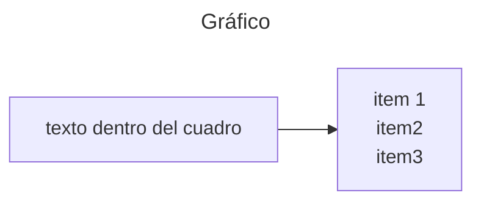


flowchart RL para invertir el flujo.
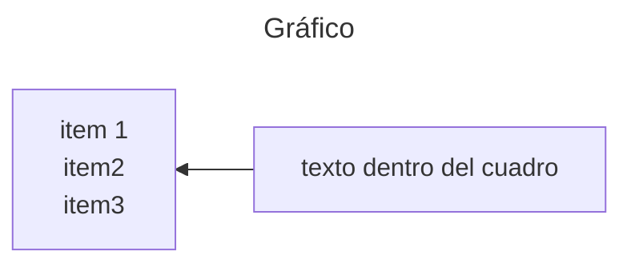

flowchart TD indica que el gráfico se realizará de arriba hacia abajo.

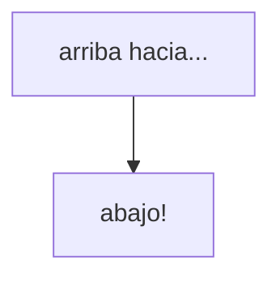


>[!abstract] Possible orientations: 
>TB - Top to bottom
>TD - Top-Down
>BT - Bottom-Top
>RL - Right to left
>LR - Left to right 

---
### Node shapes
Se define la id del primer recuadro, y entre corchetes [] se ingresa lo que va dentro del cuadro.
Finalmente se marcan las relaciones entre los cuadros entre sus IDs.

#### Round edges
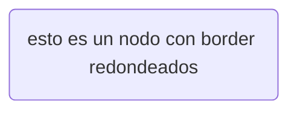

#### Stadium-shape
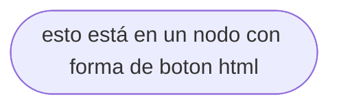


#### Subrutine
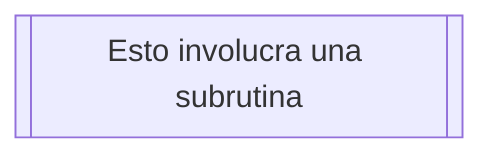

#### Cylindrical
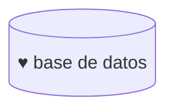


#### Circle
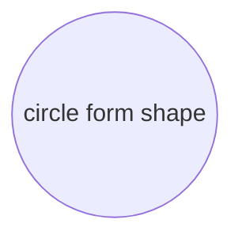

#### Asymmetric
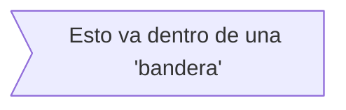

#### Rhombus
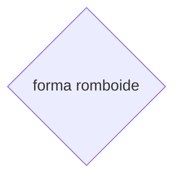

#### Hexagon
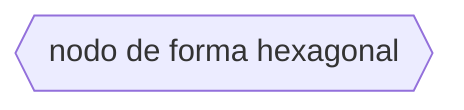

#### Parallelogram 1

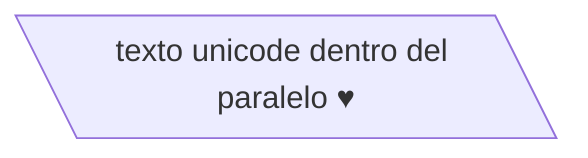

#### Parallelogram alt

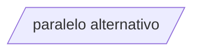

#### Trapezoid
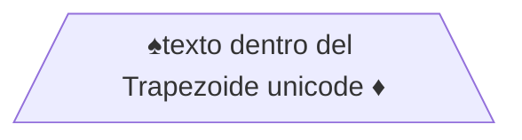

#### Trapezoid alt
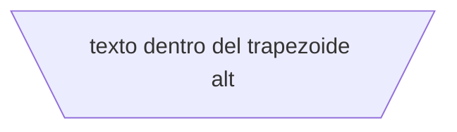

#### Double-Circle
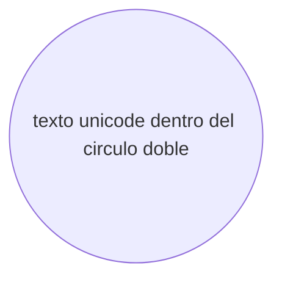

### Expanded Node shapes
Mermaid now supports a general syntax for defining shape types to accommodate the growing number of shapes. This syntax allows you to assign specific shapes to nodes using a clear and flexible format:

```
A@{ shape: rect }
```

This syntax creates a node A as a rectangle. It renders in the same way as `A["A"]`, or `A`.

#### EXAMPLES Flowchart with New Shapes

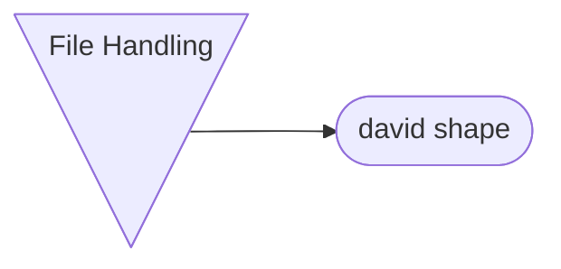

### Link beetween nodes

```
Arrow link   A --> B

Open link    A --- B

Text on link A-- Texto! ---B
			 A---|This is texto!|B

Link with arrow head and text A-->|Texto|B

Dotted link  A-.->B;

Dotted with text A-. texto! .-> B

Thick link  A ==> B

Thick with text A == texto! ==> B

Invisible link A ~~~ B

Chaining of links A -- texto --> B -- texto2 --> C

Multiple chaining of links A --> B & C --> D

Multiple links A & B --> C & D

```

#### New arrow types

```
	flowchart LR
		A --o B
```
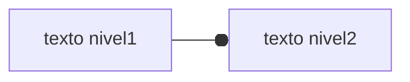


```
	flowchart LR
		A --x B
```
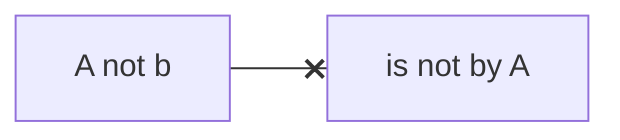

#### Multidirectional arrows

```mermaid
flowchart LR
    A o--o B
    B <--> C
    C x--x D
```


#### Minimum length of a link

Each node in the flowchart is ultimately assigned to a rank in the rendered graph, i.e. to a vertical or horizontal level (depending on the flowchart orientation), based on the nodes to which it is linked. By default, links can span any number of ranks, but you can ask for any link to be longer than the others by adding extra dashes in the link definition.

In the following example, two extra dashes are added in the link from node _B_ to node _E_, so that it spans two more ranks than regular links:

```mermaid
flowchart TD 
A[Start] --> B{Is it?} 
B -->|Yes| C[OK] 
C --> D[Rethink] 
D --> B 
B ---->|No| E[End]
```

For dotted or thick links, the characters to add are equals signs or dots, as summed up in the following table:

|Length|1|2|3|
|---|---|---|---|
|Normal|`---`|`----`|`-----`|
|Normal with arrow|`-->`|`--->`|`---->`|
|Thick|`===`|`====`|`=====`|
|Thick with arrow|`==>`|`===>`|`====>`|
|Dotted|`-.-`|`-..-`|`-...-`|
|Dotted with arrow|`-.->`|`-..->`|`-...->`|

#### Special characters that break syntax

It is possible to put text within quotes in order to render more troublesome characters. As in the example below:

##### Code:

mermaid

```
flowchart LR
    id1["This is the (text) in the box"]
```

#### Entity codes to escape characters

It is possible to escape characters using the syntax exemplified here.

##### Code:


```
    flowchart LR
        A["A double quote:#quot;"] --> B["A dec char:#9829;"]
```

Numbers given are base 10, so `#` can be encoded as `#35;`. It is also supported to use HTML character names.

Lastly, you can customize with css and classes, the diagram style colors, borders, etc.


----

## Sequence diagram

>[!info] A Sequence diagram is an interaction diagram that shows how processes operate with one another and in what order.

Full example:
```
sequenceDiagram
    participant Alice
    participant Bob
    Alice->>John: Hello John, how are you?
    loop HealthCheck
        John->>John: Fight against hypochondria
    end
    Note right of John: Rational thoughts <br/>prevail!
    John-->>Alice: Great!
    John->>Bob: How about you?
    Bob-->>John: Jolly good!
```

```mermaid
sequenceDiagram
    participant Alice
    participant Bob
    Alice->>John: Hello John, how are you?
    loop HealthCheck
        John->>John: Fight against hypochondria
    end
    Note right of John: Rational thoughts <br/>prevail!
    John-->>Alice: Great!
    John->>Bob: How about you?
    Bob-->>John: Jolly good!
```


---

#### Syntax

 * Participants

The participants can be defined implicitly as in the first example on this page. The participants or actors are rendered in order of appearance in the diagram source text. Sometimes you might want to show the participants in a different order than how they appear in the first message. It is possible to specify the actor's order of appearance by doing the following:

```
sequenceDiagram
    participant Alice
    participant Bob
    Bob->>Alice: Hi Alice
    Alice->>Bob: Hi Bob
```

```mermaid
sequenceDiagram
    participant Alice
    participant Bob
    Bob->>Alice: Hi Alice
    Alice->>Bob: Hi Bob

```

----

#### Actors

If you specifically want to use the actor symbol instead of a rectangle with text you can do so by using actor statements as per below.

```mermaid
sequenceDiagram
actor Ew
actor PFlook
Ew ->>PFlook: "Debemos poner más pppoers!"
PFlook ->>Ew: "Oiga, estoy tratando de comer mi almuerzo"
```


---

#### Aliases

The actor can have a convenient identifier and a descriptive label.

```
sequenceDiagram
    participant A as Alice
    participant J as John
    A->>J: Hello John, how are you?
    J->>A: Great!
```


---

#### Actor Creation and Destruction (v10.3.0+)[​](https://mermaid.js.org/syntax/sequenceDiagram.html#actor-creation-and-destruction-v10-3-0)

It is possible to create and destroy actors by messages. To do so, add a create or destroy directive before the message.

```
create participant B
A --> B: Hello
```

Create directives support actor/participant distinction and aliases. The sender or the recipient of a message can be destroyed but only the recipient can be created.

```
sequenceDiagram
    Alice->>Bob: Hello Bob, how are you ?
    Bob->>Alice: Fine, thank you. And you?
    create participant Carl
    Alice->>Carl: Hi Carl!
    create actor D as Donald
    Carl->>D: Hi!
    destroy Carl
    Alice-xCarl: We are too many
    destroy Bob
    Bob->>Alice: I agree
```


```mermaid
sequenceDiagram
    Alice->>Bob: Hello Bob, how are you ?
    Bob->>Alice: Fine, thank you. And you?
    create participant Carl
    Alice->>Carl: Hi Carl!
    create actor D as Donald
    Carl->>D: Hi!
    destroy Carl
    Alice-xCarl: We are too many
    destroy Bob
    Bob->>Alice: I agree
```

---

#### Grouping / Box.

The actor(s) can be grouped in vertical boxes. You can define a color (if not, it will be transparent) and/or a descriptive label using the following notation:
```
box Aqua Group Description
... actors ...
end
box Group without description
... actors ...
end
box rgb(33,66,99)
... actors ...
end
box rgba(33,66,99,0.5)
... actors ...
end
```

example:

```mermaid
    sequenceDiagram
    box rgb(0, 170, 90) Alice & John
    participant A
    participant J
    end
    box Yellow Another Group
    participant B
    participant C
    end
    A->>J: Hello John, how are you?
    J->>A: Great!
    A->>B: Hello Bob, how is Charley?
    B->>C: Hello Charley, how are you?
```

---

#### Messages.

Messages can be of two displayed either solid or with a dotted line.

```
[Actor][Arrow][Actor]:Message text
```

There are ten types of arrows currently supported:

|Type|Description|
|---|---|
|`->`|Solid line without arrow|
|`-->`|Dotted line without arrow|
|`->>`|Solid line with arrowhead|
|`-->>`|Dotted line with arrowhead|
|`<<->>`|Solid line with bidirectional arrowheads (v11.0.0+)|
|`<<-->>`|Dotted line with bidirectional arrowheads (v11.0.0+)|
|`-x`|Solid line with a cross at the end|
|`--x`|Dotted line with a cross at the end|
|`-)`|Solid line with an open arrow at the end (async)|
|`--)`|Dotted line with a open arrow at the end (async)|

---

#### Activations.

It is possible to activate and deactivate an actor. (de)activation can be dedicated declarations:

```
sequenceDiagram
    Alice->>John: Hello John, how are you?
    activate John
    John-->>Alice: Great!
    deactivate John
```


```mermaid
sequenceDiagram
    Alice->>John: Hello John, how are you?
    activate John
    John-->>Alice: Great!
    deactivate John
```

---

#### Notes.

It is possible to add notes to a sequence diagram. This is done by the notation Note \[ right of | left of | over ] \[Actor]: Text in note content

example
```
sequenceDiagram
    participant John
    Note right of John: Text in note
```

```mermaid
sequenceDiagram
    participant John
    Note right of John: Text in note
```

* Note spanning two participants

```
sequenceDiagram
    Alice->John: Hello John, how are you?
    Note over Alice,John: A typical interaction
```

```mermaid
sequenceDiagram
    Alice->John: Hello John, how are you?
    Note over Alice,John: A typical interaction
```
* Linebreaks can be added to Note and Messages:

```
sequenceDiagram
    Alice->John: Hello John,<br/>how are you?
    Note over Alice,John: A typical interaction<br/>But now in two lines
```

```mermaid
sequenceDiagram
    Alice->John: Hello John,<br/>how are you?
    Note over Alice,John: A typical interaction<br/>But now in two lines
```

* Line breaks in Actor names requires aliases:

```
sequenceDiagram
    participant Alice as Alice<br/>Johnson
    Alice->John: Hello John,<br/>how are you?
    Note over Alice,John: A typical interaction<br/>But now in two lines
```

```mermaid
sequenceDiagram
    participant Alice as Alice<br/>Johnson
    Alice->John: Hello John,<br/>how are you?
    Note over Alice,John: A typical interaction<br/>But now in two lines
```


#### Loops.

It is possible to express loops in a sequence diagram. This is done by the notation

```
sequenceDiagram
    Alice->John: Hello John, how are you?
    loop Every minute
        John-->Alice: Great!
    end
```

```mermaid
sequenceDiagram
    Alice->John: Hello John, how are you?
    loop Every minute
        John-->Alice: Great!
    end
```


#### Alt.

It is possible to express alternative paths in a sequence diagram. This is done by the notation

```
alt Describing text
... statements ...
else
... statements ...
end
```

or if there is sequence that is optional (if without else).

```
opt Describing text
... statements ...
end
```

Example
```mermaid
sequenceDiagram
    Alice->>Bob: Hello Bob, how are you?
    alt is sick
        Bob->>Alice: Not so good :(
    else is well
        Bob->>Alice: Feeling fresh like a daisy
    end
    opt Extra response
        Bob->>Alice: Thanks for asking
    end

```


#### Parallel.

It is possible to show actions that are happening in parallel.

```
sequenceDiagram
    par Alice to Bob
        Alice->>Bob: Hello guys!
    and Alice to John
        Alice->>John: Hello guys!
    end
    Bob-->>Alice: Hi Alice!
    John-->>Alice: Hi Alice!

```

```mermaid
sequenceDiagram
    par Alice to Bob
        Alice->>Bob: Hello guys!
    and Alice to John
        Alice->>John: Hello guys!
    end
    Bob-->>Alice: Hi Alice!
    John-->>Alice: Hi Alice!
```


It is also possible to nest parallel blocks.
```
sequenceDiagram
    par Alice to Bob
        Alice->>Bob: Go help John
    and Alice to John
        Alice->>John: I want this done today
        par John to Charlie
            John->>Charlie: Can we do this today?
        and John to Diana
            John->>Diana: Can you help us today?
        end
    end
```


#### Critical Region

It is possible to show actions that must happen automatically with conditional handling of circumstances.
**It is also possible to have no options at all**

This is done by the notation

```
critical [Action that must be performed]
... statements ...
option [Circumstance A]
... statements ...
option [Circumstance B]
... statements ...
end
```


Example:

```mermaid
sequenceDiagram
    critical Establish a connection to the DB
        Service-->DB: connect
    option Network timeout
        Service-->Service: Log error
    option Credentials rejected
        Service-->Service: Log different error
    end
```


#### Break.

It is possible to indicate a stop of the sequence within the flow (usually used to model exceptions).

This is done by the notation

```
break [something happened]
... statements ...
end
```

Example: 

```
sequenceDiagram
    Consumer-->API: Book something
    API-->BookingService: Start booking process
    break when the booking process fails
        API-->Consumer: show failure
    end
    API-->BillingService: Start billing process
```


#### Background Highlighting.

It is possible to highlight flows by providing colored background rects. This is done by the notation

```
rect COLOR
... content ...
end
```

The colors are defined using rgb and rgba syntax.

```
rect rgb(0, 255, 0)
... content ...
end
```

```
rect rgba(0, 0, 255, .1)
... content ...
end
```

Example:
```mermaid
sequenceDiagram
    participant Alice
    participant John

    rect rgb(191, 223, 255)
    note right of Alice: Alice calls John.
    Alice->>+John: Hello John, how are you?
    rect rgb(200, 150, 255)
    Alice->>+John: John, can you hear me?
    John-->>-Alice: Hi Alice, I can hear you!
    end
    John-->>-Alice: I feel great!
    end
    Alice ->>+ John: Did you want to go to the game tonight?
    John -->>- Alice: Yeah! See you there.


```


#### Actor Menus

Actors can have popup-menus containing individualized links to external pages. For example, if an actor represented a web service, useful links might include a link to the service health dashboard, repo containing the code for the service, or a wiki page describing the service.

This can be configured by adding one or more link lines with the format:

```
link <actor>: <link-label> @ <link-url>
```

Example:

```mermaid
sequenceDiagram
    participant Google
    participant User
    link Google: web@https://www.google.com
    link Google: Wiki@https://wiki.google.com
    link User: Dashboard@https://dashboard.contoso.com/john
    link User: Wiki@https://wiki.contoso.com/john
    Google->>User: Search box
    User-->>Google: Input search term
    Google-)User: Query Results
```

There is an advanced syntax that relies on JSON formatting. If you are comfortable with JSON format, then this exists as well.

This can be configured by adding the links lines with the format:
```
links <actor>: <json-formatted link-name link-url pairs>
```

```mermaid
sequenceDiagram
	participant Google
	participant User
	links Google: {"Web": "https://www.google.com", "Wiki": "https://wiki.google.com"}
```


----

## Gantt diagram


```
gantt
dateFormat  YYYY-MM-DD
title Adding GANTT diagram to mermaid
excludes weekdays 2014-01-10

section A section
Completed task            :done,    des1, 2014-01-06,2014-01-08
Active task               :active,  des2, 2014-01-09, 3d
Future task               :         des3, after des2, 5d
Future task2               :         des4, after des3, 5d
```


```mermaid
gantt
dateFormat  YYYY-MM-DD
title Adding GANTT diagram to mermaid
excludes weekdays 2014-01-10

section A section
Completed task            :done,    des1, 2014-01-06,2014-01-08
Active task               :active,  des2, 2014-01-09, 3d
Future task               :         des3, after des2, 5d
Future task2               :         des4, after des3, 5d
```

ejemplo
```mermaid
gantt
dateFormat YYYY-MM-DD
title Llamadas de soporte
excludes weekdays 2025-01-11

section botmaker
migracion iptv             :done, des1, 2025-01-01, 2025-01-25
falta de link              :active, des2, 2025-01-01, 15d
migracion internet         :       des3, after des2, 10d
```

---

## Class diagram.


"In software engineering, a class diagram in the Unified Modeling Language (UML) is a type of static structure diagram that describes the structure of a system by showing the system's classes, their attributes, operations (or methods), and the relationships among objects."

The class diagram is the main building block of object-oriented modeling. It is used for general conceptual modeling of the structure of the application, and for detailed modeling to translate the models into programming code. Class diagrams can also be used for data modeling. The classes in a class diagram represent both the main elements, interactions in the application, and the classes to be programmed.


```
classDiagram
Class01 <|-- AveryLongClass : Cool
Class03 *-- Class04
Class05 o-- Class06
Class07 .. Class08
Class09 --> C2 : Where am i?
Class09 --* C3
Class09 --|> Class07
Class07 : equals()
Class07 : Object[] elementData
Class01 : size()
Class01 : int chimp
Class01 : int gorilla
Class08 <--> C2: Cool label
```

```mermaid
classDiagram
Class01 <|-- AveryLongClass : Cool
Class03 *-- Class04
Class05 o-- Class06
Class07 .. Class08
Class09 --> C2 : Where am i?
Class09 --* C3
Class09 --|> Class07
Class07 : equals()
Class07 : Object[] elementData
Class01 : size()
Class01 : int chimp
Class01 : int gorilla
Class08 <--> C2: Cool label
```


---

Example:

```
---
title: Animal example
---
classDiagram
    note "From Duck till Zebra"
    Animal <|-- Duck
    note for Duck "can fly\ncan swim\ncan dive\ncan help in debugging"
    Animal <|-- Fish
    Animal <|-- Zebra
    Animal : +int age
    Animal : +String gender
    Animal: +isMammal()
    Animal: +mate()
    class Duck{
        +String beakColor
        +swim()
        +quack()
    }
    class Fish{
        -int sizeInFeet
        -canEat()
    }
    class Zebra{
        +bool is_wild
        +run()
    }
```

```mermaid
---
title: Animal example
---
classDiagram
    note "From Duck till Zebra"
    Animal <|-- Duck
    note for Duck "can fly\ncan swim\ncan dive\ncan help in debugging"
    Animal <|-- Fish
    Animal <|-- Zebra
    Animal : +int age
    Animal : +String gender
    Animal: +isMammal()
    Animal: +mate()
    class Duck{
        +String beakColor
        +swim()
        +quack()
    }
    class Fish{
        -int sizeInFeet
        -canEat()
    }
    class Zebra{
        +bool is_wild
        +run()
    }

```

### Syntax

***Class***

UML provides mechanisms to represent class members, such as **attributes** and **methods**, and additional information about them. A single instance of a class in the diagram contains three compartments:

- The top compartment contains the **name of the class**. It is printed in bold and centered, and the first letter is capitalized. It may also contain optional annotation text describing the nature of the class.
- The middle compartment contains the **attributes of the class**. They are left-aligned and the first letter is lowercase.
- The bottom compartment contains **the operations the class** can execute. They are also left-aligned and the first letter is lowercase.


### Define a class

There are two ways to define a class:

- Explicitly using keyword **class** like `class Animal` which would define the Animal class.
- Via a **relationship** which defines two classes at a time along with their relationship. For instance, `Vehicle <|-- Car`.

Naming convention: a class name should be composed only of alphanumeric characters (including unicode), underscores, and dashes (-).

```
classDiagram
    class Animal
    Vehicle <|-- Car
```

```mermaid
classDiagram
    class Animal
    Vehicle <|-- Car
    Vehicle : drive()
    Vehicle : 4 wheels
```

### Class labels

In case you need to provide a label for a class, you can use the following syntax:
You can also use backticks to escape special characters in the label

```
classDiagram
    class Animal["Animal with a label"]
    class Car["Car with *! symbols"]
    Animal --> Car
```

```mermaid
classDiagram
    class Animal["Animal with a label"]
    class Car["Car with *! symbols"]
    Animal --> Car
```

### Defining Members of a class

UML provides mechanisms to represent class members such as attributes and methods, as well as additional information about them.

Mermaid distinguishes between attributes and functions/methods based on if the **parenthesis** `()` are present or not. The ones with `()` are treated as functions/methods, and all others as attributes.

There are two ways to define the members of a class, and regardless of whichever syntax is used to define the members, the output will still be same. The two different ways are :

- Associate a member of a class using **:** (colon) followed by member name, useful to define one member at a time. For example:

```
classDiagram
class BankAccount
BankAccount : +String owner
BankAccount : +BigDecimal balance
BankAccount : +deposit(amount)
BankAccount : +withdrawal(amount)
```

- Associate members of a class using **{}** brackets, where members are grouped within curly brackets. Suitable for defining multiple members at once. For example:

```
classDiagram
class BankAccount{
    +String owner
    +BigDecimal balance
    +deposit(amount)
    +withdrawal(amount)
}
```

#### Return Type

Optionally you can end a method/function definition with the data type that will be returned (note: there must be a space between the final `)` and the return type). An example:

```
classDiagram
class BankAccount{
    +String owner
    +BigDecimal balance
    +deposit(amount) bool
    +withdrawal(amount) int
}
```

#### Generic Types

Generics can be represented as part of a class definition, and for class members/return types. In order to denote an item as generic, you enclose that type within `~` (**tilde**). **Nested** type declarations such as `List<List<int>>` are supported, though generics that include a comma are currently not supported. (such as `List<List<K, V>>`)

> _note_ when a generic is used within a class definition, the generic type is NOT considered part of the class name. i.e.: for any syntax which required you to reference the class name, you need to drop the type part of the definition. This also means that mermaid does not currently support having two classes with the same name, but different generic types.

```
classDiagram
class Square~Shape~{
    int id
    List~int~ position
    setPoints(List~int~ points)
    getPoints() List~int~
}

Square : -List~string~ messages
Square : +setMessages(List~string~ messages)
Square : +getMessages() List~string~
Square : +getDistanceMatrix() List~List~int~~
```


### Visibility

To describe the visibility (or encapsulation) of an attribute or method/function that is a part of a class (i.e. a class member), optional notation may be placed before that members' name:

- `+` Public
- `-` Private
- `#` Protected
- `~` Package/Internal

 _note_ you can also include additional _classifiers_ to a method definition by adding the following notation to the _end_ of the method, i.e.: after the `()` or after the return type:
 
 - `*` Abstract e.g.: `someAbstractMethod()*` or `someAbstractMethod() int*`
 - `$` Static e.g.: `someStaticMethod()$` or `someStaticMethod() String$`

 _note_ you can also include additional _classifiers_ to a field definition by adding the following notation to the very end:
 
 - `$` Static e.g.: `String someField$`

### Defining Relationship

A relationship is a general term covering the specific types of logical connections found on class and object diagrams.

```
[classA][Arrow][ClassB]
```

There are eight different types of relations defined for classes under UML which are currently supported:

|Type|Description|
|---|---|
|`<\|--`|Inheritance|
|`*--`|Composition|
|`o--`|Aggregation|
|`-->`|Association|
|`--`|Link (Solid)|
|`..>`|Dependency|
|`..\|>`|Realization|
|`..`|Link (Dashed)|

### Labels on Relations

It is possible to add label text to a relation:

```
[classA][Arrow][ClassB]:LabelText
```

Example:
```mermaid
classDiagram
classA <|-- classB : implements
classC *-- classD : composition
classE o-- classF : aggregation
```


### Two-way relations

Relations can logically represent an N:M association:

Here is the syntax:

```
[Relation Type][Link][Relation Type]
```

Where `Relation Type` can be one of:

|Type|Description|
|---|---|
|`<\|`|Inheritance|
|`\*`|Composition|
|`o`|Aggregation|
|`>`|Association|
|`<`|Association|
|`\|>`|Realization|

And `Link` can be one of:

|Type|Description|
|---|---|
|--|Solid|
|..|Dashed|


### Define Namespace

A namespace groups classes.


```
classDiagram
namespace BaseShapes {
    class Triangle
    class Rectangle {
      double width
      double height
    }
}
```

```mermaid
classDiagram
namespace BaseShapes {
    class Triangle
    class Rectangle {
      double width
      double height
    }
}
```


### Cardinality / Multiplicity on relations

Multiplicity or cardinality in class diagrams indicates the number of instances of one class that can be linked to an instance of the other class. For example, each company will have one or more employees (not zero), and each employee currently works for zero or one companies.

Multiplicity notations are placed near the end of an association.

The different cardinality options are :

- `1` Only 1
- `0..1` Zero or One
- `1..*` One or more
- `*`      Many
- `n`      n (where n>1)
- `0..n` zero to n (where n>1)
- `1..n` one to n (where n>1)

Cardinality can be easily defined by placing the text option within quotes `"` before or after a given arrow. For example:

```
[classA] "cardinality1" [Arrow] "cardinality2" [ClassB]:LabelText
```

Example:

```mermaid
classDiagram
    Customer "1" --> "*" Ticket
    Student "1" --> "1..*" Course
    Galaxy --> "many" Star : Contains
```


### Annotations on classes

It is possible to annotate classes with markers to provide additional metadata about the class. This can give a clearer indication about its nature. Some common annotations include:

- `<<Interface>>` To represent an Interface class
- `<<Abstract>>` To represent an abstract class
- `<<Service>>` To represent a service class
- `<<Enumeration>>` To represent an enum

Annotations are defined within the opening `<<` and closing `>>`. There are two ways to add an annotation to a class, and either way the output will be same:

- In a **_separate line_** after a class is defined:

```
classDiagram
class Shape
<<interface>> Shape
Shape : noOfVertices
Shape : draw()
```

- In a **_nested structure_** along with the class definition:

```mermaid
classDiagram
class Shape{
    <<interface>>
    noOfVertices
    draw()
}
class Color{
    <<enumeration>>
    RED
    BLUE
    GREEN
    WHITE
    BLACK
}
```


### Setting the direction of the diagram

With class diagrams you can use the direction statement to set the direction in which the diagram will render:

```
classDiagram
  direction RL
  class Student {
    -idCard : IdCard
  }
  class IdCard{
    -id : int
    -name : string
  }
  class Bike{
    -id : int
    -name : string
  }
  Student "1" --o "1" IdCard : carries
  Student "1" --o "1" Bike : rides
```

```mermaid
classDiagram
  direction RL
  class Student {
    -idCard : IdCard
  }
  class IdCard{
    -id : int
    -name : string
  }
  class Bike{
    -id : int
    -name : string
  }
  Student "1" --o "1" IdCard : carries
  Student "1" --o "1" Bike : rides
```


### Interaction

It is possible to bind a click event to a node. The click can lead to either a javascript callback or to a link which will be opened in a new browser tab. **Note**: This functionality is disabled when using `securityLevel='strict'` and enabled when using `securityLevel='loose'`.

You would define these actions on a separate line after all classes have been declared.
```
action className "reference" "tooltip"
click className call callback() "tooltip"
click className href "url" "tooltip"
```


- _action_ is either `link` or `callback`, depending on which type of interaction you want to have called
- _className_ is the id of the node that the action will be associated with
- _reference_ is either the url link, or the function name for callback.
- (_optional_) tooltip is a string to be displayed when hovering over element (note: The styles of the tooltip are set by the class .mermaidTooltip.)
- note: callback function will be called with the nodeId as parameter.

### Notes

It is possible to add notes on the diagram using `note "line1\nline2"`. A note can be added for a specific class using `note for <CLASS NAME> "line1\nline2"`.

```
classDiagram
    note "This is a general note"
    note for MyClass "This is a note for a class"
    class MyClass{
    }
```

```mermaid
classDiagram
    note "This is a general note"
    note for MyClass "This is a note for a class"
    class MyClass{
    }
```

URL Link:
```
classDiagram
class Shape
link Shape "https://www.github.com" "This is a tooltip for a link"
class Shape2
click Shape2 href "https://www.github.com" "This is a tooltip for a link"
```

Callback:
```
classDiagram
class Shape
callback Shape "callbackFunction" "This is a tooltip for a callback"
class Shape2
click Shape2 call callbackFunction() "This is a tooltip for a callback"
```


Script:
```js
<script>
  const callbackFunction = function () {
    alert('A callback was triggered');
  };
</script>
```


Example:
```
classDiagram
    class Class01
    class Class02
    callback Class01 "callbackFunction" "Callback tooltip"
    link Class02 "https://www.github.com" "This is a link"
    class Class03
    class Class04
    click Class03 call callbackFunction() "Callback tooltip"
    click Class04 href "https://www.github.com" "This is a link"
```


### Styling[​](https://mermaid.js.org/syntax/classDiagram.html#styling)

#### Styling a node[​](https://mermaid.js.org/syntax/classDiagram.html#styling-a-node)

It is possible to apply specific styles such as a thicker border or a different background color to an individual node using the `style` keyword.

Note that notes and namespaces cannot be styled individually but do support themes.

```
classDiagram
  class Animal
  class Mineral
  style Animal fill:#f9f,stroke:#333,stroke-width:4px
  style Mineral fill:#bbf,stroke:#f66,stroke-width:2px,color:#fff,stroke-dasharray: 5 5
```


```mermaid
classDiagram
  class Animal
  class Mineral
  style Animal fill:#f9f,stroke:#333,stroke-width:4px
  style Mineral fill:#bbf,stroke:#f66,stroke-width:2px,color:#fff,stroke-dasharray: 5 5
```

#### Classes

More convenient than defining the style every time is to define a class of styles and attach this class to the nodes that should have a different look.

A class definition looks like the example below:
```
classDef className fill:#f9f,stroke:#333,stroke-width:4px;
```


Also, it is possible to define style to multiple classes in one statement:
```
classDef firstClassName,secondClassName font-size:12pt;
```

Attachment of a class to a node is done as per below:
```
cssClass "nodeId1" className;
```

It is also possible to attach a class to a list of nodes in one statement:
```
cssClass "nodeId1,nodeId2" className;
```


A shorter form of adding a class is to attach the classname to the node using the `:::` operator:
```
classDiagram
    class Animal:::someclass
    classDef someclass fill:#f96
```


```
classDiagram
    class Animal:::someclass {
        -int sizeInFeet
        -canEat()
    }
    classDef someclass fill:#f96
```


#### Default class

If a class is named default it will be applied to all nodes. Specific styles and classes should be defined afterwards to override the applied default styling.

```
classDef default fill:#f9f,stroke:#333,stroke-width:4px;
```


----


## Git graph.


commit id:"12345"
commit tag:"algun tag"
branch (nombre de nueva rama)
checkout (nombre de la rama a seguir)
commit type:[HIGHLIGHT / REVERSE / NORMAL]


```
    gitGraph
       commit
       commit
       branch develop
       commit
       commit
       commit
       checkout main
       commit
       commit
```

```mermaid
    gitGraph
       commit
       commit
       branch develop
       commit
       commit
       commit
       checkout main
       commit
       commit
```


```mermaid
	gitGraph
			commit "david"
			commit id:"735024"
			branch menuContextual
			commit tag:"giordano"
			commit 
			checkout main
			commit type:HIGHLIGHT 
			commit
			checkout main
			commit
			commit
			
```


### Adding custom commit id[​](https://mermaid.js.org/syntax/gitgraph.html#adding-custom-commit-id)

For a given commit you may specify a custom ID at the time of declaring it using the `id` attribute, followed by `:` and your custom value within a `""` quote. For example: `commit id: "your_custom_id"`

Let us see how this works with the help of the following diagram:

```
    gitGraph
       commit id: "Alpha"
       commit id: "Beta"
       commit id: "Gamma"
```

```mermaid
    gitGraph
       commit id: "Alpha"
       commit id: "Beta"
       commit id: "Gamma"
```

### Modifying commit type[​](https://mermaid.js.org/syntax/gitgraph.html#modifying-commit-type)

In Mermaid, a commit can be of three type, which render a bit different in the diagram. These types are:

- `NORMAL` : Default commit type. Represented by a solid circle in the diagram
- `REVERSE` : To emphasize a commit as a reverse commit. Represented by a crossed solid circle in the diagram.
- `HIGHLIGHT` : To highlight a particular commit in the diagram. Represented by a filled rectangle in the diagram.

For a given commit you may specify its type at the time of declaring it using the `type` attribute, followed by `:` and the required type option discussed above. 

For example: `commit type: HIGHLIGHT`

Let us see how these different commit type look with the help of the following diagram:

```
    gitGraph
       commit id: "Normal"
       commit
       commit id: "Reverse" type: REVERSE
       commit
       commit id: "Highlight" type: HIGHLIGHT
       commit
```

```mermaid
    gitGraph
       commit id: "Normal"
       commit
       commit id: "Reverse" type: REVERSE
       commit
       commit id: "Highlight" type: HIGHLIGHT
       commit
```
### Adding Tags[​](https://mermaid.js.org/syntax/gitgraph.html#adding-tags)

For a given commit you may decorate it as a **tag**, similar to the concept of tags or release version in git world. You can attach a custom tag at the time of declaring a commit using the `tag` attribute, followed by `:` and your custom value within `""` quote. 
For example: `commit tag: "your_custom_tag"`

```
    gitGraph
       commit
       commit id: "Normal" tag: "v1.0.0"
       commit
       commit id: "Reverse" type: REVERSE tag: "RC_1"
       commit
       commit id: "Highlight" type: HIGHLIGHT tag: "8.8.4"
       commit
```

```mermaid
    gitGraph
       commit
       commit id: "Normal" tag: "v1.0.0"
       commit
       commit id: "Reverse" type: REVERSE tag: "RC_1"
       commit
       commit id: "Highlight" type: HIGHLIGHT tag: "8.8.4"
       commit
```

In this example, we have given custom tags to the commits. Also, see how we have combined all these attributes in a single commit declaration. You can mix-match these attributes as you like.

### Create a new branch

In Mermaid, in-order to create a new branch, you make use of the `branch` keyword. You also need to provide a name of the new branch. The name has to be unique and cannot be that of an existing branch. A branch name that could be confused for a keyword must be quoted within `""`. Usage examples: `branch develop`, `branch "cherry-pick"`

When Mermaid, reads the `branch` keyword, it creates a new branch and sets it as the current branch. Equivalent to you creating a new branch and checking it out in Git world.

Let see this in an example:
```
    gitGraph
       commit
       commit
       branch develop
       commit
       commit
       commit
```

```mermaid
    gitGraph
       commit
       commit
       branch develop
       commit
       commit
       commit
```

>[!tip] In this example, see how we started with default `main` branch, and pushed two commits on that. Then we created the `develop` branch, and all commits afterwards are put on the `develop` branch as it became the current branch

### Checking out an existing branch

In Mermaid, in order to switch to an existing branch, you make use of the `checkout` keyword. You also need to provide a name of an existing branch. If no branch is found with the given name, it will result in console error. Usage example: `checkout develop`

When Mermaid, reads the `checkout` keyword, it finds the given branch and sets it as the current branch. Equivalent to checking out a branch in the Git world.

Let see modify our previous example:
```
    gitGraph
       commit
       commit
       branch develop
       commit
       commit
       commit
       checkout main
       commit
       commit
```

```mermaid
    gitGraph
       commit
       commit
       branch develop
       commit
       commit
       commit
       checkout main
       commit
       commit

```
In this example, see how we started with default `main` branch, and pushed two commits on that. Then we created the `develop` branch, and all three commits afterwards are put on the `develop` branch as it became the current branch. After this we made use of the `checkout` keyword to set the current branch as `main`, and all commit that follow are registered against the current branch, i.e. `main`.

### Merging two branches

In Mermaid, in order to merge or join to an existing branch, you make use of the `merge` keyword. You also need to provide the name of an existing branch to merge from. If no branch is found with the given name, it will result in console error. Also, you can only merge two separate branches, and cannot merge a branch with itself. In such case an error is throw.

Usage example: `merge develop`

When Mermaid, reads the `merge` keyword, it finds the given branch and its head commit (the last commit on that branch), and joins it with the head commit on the **current branch**. Each merge results in a **_merge commit_**, represented in the diagram with **filled double circle**.

Let us modify our previous example to merge our two branches:

```
    gitGraph
       commit
       commit
       branch develop
       commit
       commit
       commit
       checkout main
       commit
       commit
       merge develop
       commit
       commit
```

```mermaid
    gitGraph
       commit
       commit
       branch develop
       commit
       commit
       commit
       checkout main
       commit
       commit
       merge develop
       commit
       commit
```

In this example, see how we started with default `main` branch, and pushed two commits on that. Then we created the `develop` branch, and all three commits afterwards are put on the `develop` branch as it became the current branch. After this we made use of the `checkout` keyword to set the current branch as `main`, and all commits that follow are registered against the current branch, i.e. `main`. After this we merge the `develop` branch onto the current branch `main`, resulting in a merge commit. Since the current branch at this point is still `main`, the last two commits are registered against that.

You can also decorate your merge with similar attributes as you did for the commit using:

- `id`--> To override the default ID with custom ID
- `tag`--> To add a custom tag to your merge commit
- `type`--> To override the default shape of merge commit. Here you can use other commit type mentioned earlier.

### Cherry Pick commit from another branch

Similar to how 'git' allows you to cherry-pick a commit from **another branch** onto the **current** branch, Mermaid also supports this functionality. You can also cherry-pick a commit from another branch using the `cherry-pick` keyword.

To use the `cherry-pick` keyword, you must specify the id using the `id` attribute, followed by `:` and your desired commit id within a `""` quote. For example:

`cherry-pick id: "your_custom_id"`

Here, a new commit representing the cherry-pick is created on the current branch, and is visually highlighted in the diagram with a **cherry** and a tag depicting the commit id from which it is cherry-picked from.

A few important rules to note here are:

1. You need to provide the `id` for an existing commit to be cherry-picked. If given commit id does not exist it will result in an error. For this, make use of the `commit id:$value` format of declaring commits. See the examples from above.
2. The given commit must not exist on the current branch. The cherry-picked commit must always be a different branch than the current branch.
3. Current branch must have at least one commit, before you can cherry-pick, otherwise it will cause an error is throw.
4. When cherry-picking a merge commit, providing a parent commit ID is mandatory. If the parent attribute is omitted or an invalid parent commit ID is provided, an error will be thrown.
5. The specified parent commit must be an immediate parent of the merge commit being cherry-picked.

Let see an example:
```
    gitGraph
        commit id: "ZERO"
        branch develop
        branch release
        commit id:"A"
        checkout main
        commit id:"ONE"
        checkout develop
        commit id:"B"
        checkout main
        merge develop id:"MERGE"
        commit id:"TWO"
        checkout release
        cherry-pick id:"MERGE" parent:"B"
        commit id:"THREE"
        checkout develop
        commit id:"C"
```

```mermaid
    gitGraph
        commit id: "ZERO"
        branch develop
        branch release
        commit id:"A"
        checkout main
        commit id:"ONE"
        checkout develop
        commit id:"B"
        checkout main
        merge develop id:"MERGE"
        commit id:"TWO"
        checkout release
        cherry-pick id:"MERGE" parent:"B"
        commit id:"THREE"
        checkout develop
        commit id:"C"
```

### Customizing main branch name

Sometimes you may want to customize the name of the main/default branch. You can do this by using the `mainBranchName` keyword. By default its value is `main`. You can set it to any string using directives.

Usage example:
```
%%{init: { 'logLevel': 'debug', 'theme': 'base', 'gitGraph': {'showBranches': true, 'showCommitLabel':true,'mainBranchName': 'MetroLine1'}} }%%
      gitGraph
        commit id:"NewYork"
        commit id:"Dallas"
        branch MetroLine2
        commit id:"LosAngeles"
        commit id:"Chicago"
        commit id:"Houston"
        branch MetroLine3
        commit id:"Phoenix"
        commit type: HIGHLIGHT id:"Denver"
        commit id:"Boston"
        checkout MetroLine1
        commit id:"Atlanta"
        merge MetroLine3
        commit id:"Miami"
        commit id:"Washington"
        merge MetroLine2 tag:"MY JUNCTION"
        commit id:"Boston"
        commit id:"Detroit"
        commit type:REVERSE id:"SanFrancisco"
```


```mermaid
%%{init: { 'logLevel': 'debug', 'theme': 'dark', 'gitGraph': {'showBranches': true, 'showCommitLabel':true,'mainBranchName': 'MetroLine1'}} }%%
      gitGraph
        commit id:"NewYork"
        commit id:"Dallas"
        branch MetroLine2
        commit id:"LosAngeles"
        commit id:"Chicago"
        commit id:"Houston"
        branch MetroLine3
        commit id:"Phoenix"
        commit type: HIGHLIGHT id:"Denver"
        commit id:"Boston"
        checkout MetroLine1
        commit id:"Atlanta"
        merge MetroLine3
        commit id:"Miami"
        commit id:"Washington"
        merge MetroLine2 tag:"MY JUNCTION"
        commit id:"Boston"
        commit id:"Detroit"
        commit type:REVERSE id:"SanFrancisco"
```
Look at the imaginary railroad map created using Mermaid. Here, we have changed the default main branch name to `MetroLine1`.

----

## Entity Relationship Diagrams[​](https://mermaid.js.org/syntax/entityRelationshipDiagram.html#entity-relationship-diagrams)

An entity–relationship model (or ER model) describes interrelated things of interest in a specific domain of knowledge. A basic ER model is composed of entity types (which classify the things of interest) and specifies relationships that can exist between entities (instances of those entity types)


Note that practitioners of ER modelling almost always refer to _entity types_ simply as _entities_. For example the `CUSTOMER` entity _type_ would be referred to simply as the `CUSTOMER` entity. This is so common it would be inadvisable to do anything else, but technically an entity is an abstract _instance_ of an entity type, and this is what an ER diagram shows - abstract instances, and the relationships between them. This is why entities are always named using singular nouns.

EJEMPLO:
```
---
title: Order example
---
erDiagram
    CUSTOMER ||--o{ ORDER : places
    ORDER ||--|{ LINE-ITEM : contains
    CUSTOMER }|..|{ DELIVERY-ADDRESS : uses
```

```mermaid
---
title: Order example
---
erDiagram
    CUSTOMER ||--o{ ORDER : places
    ORDER ||--|{ LINE-ITEM : contains
    CUSTOMER }|..|{ DELIVERY-ADDRESS : uses
```
