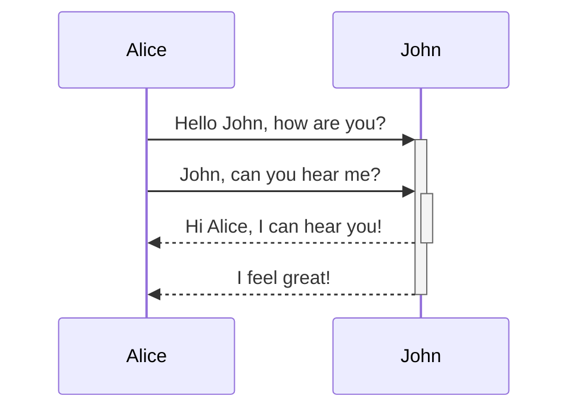

# index

[[#Basic formatting|Basic Formatting Syntax]]

[[#Advanced Formatting|Advanced Formatting Syntax]]

---

## Basic formatting

### Line breaks 

By default in Obsidian, pressing `Enter` once will create a new line in your note, but this is treated as a _continuation_ of the same paragraph in the rendered output, following typical Markdown behavior. To insert a line break _within_ a paragraph without starting a new paragraph, you can either:

- Add **two spaces** at the end of a line before pressing `Enter`, or
- Use the shortcut `Shift + Enter` to directly insert a line break.


### Headings

```
# This is a heading 1
## This is a heading 2 
### This is a heading 3 
#### This is a heading 4 
##### This is a heading 5 
###### This is a heading 6
```


### Formatting text

| Style                  | Syntax                 | Example                                  | Output                                 |
| ---------------------- | ---------------------- | ---------------------------------------- | -------------------------------------- |
| Bold                   | `** **` or `__ __`     | `**Bold text**`                          | **Bold text**                          |
| Italic                 | `* *` or `_ _`         | `*Italic text*`                          | _Italic text_                          |
| Strikethrough          | `~~ ~~`                | `~~Striked out text~~`                   | ~~Striked out text~~                   |
| Highlight              | `== ==`                | `==Highlighted text==`                   | ==Highlighted text==                   |
| Bold and nested italic | `** **` and `_ _`      | `**Bold text and _nested italic_ text**` | **Bold text and _nested italic_ text** |
| Bold and italic        | `*** ***` or `___ ___` | `***Bold and italic text***`             | **_Bold and italic text_**             |

Formatting can be forced to display in plain text by adding a backslash `\` in front of it.

\**This line will not be bold*\*

```
\*\*This line will not be bold\*\*
```

---

### Internal links 

Obsidian supports two formats for [internal links](https://help.obsidian.md/links) between notes:

- Wikilink: `[[Three laws of motion]]`
- Markdown: `[Three laws of motion](Three%20laws%20of%20motion.md)`


---

### Multiple blank spaces

Multiple adjacent blank spaces within and between paragraphs collapse into a single space when displayed in [Reading view](https://help.obsidian.md/edit-and-read#Editor%20views) or on [Obsidian Publish](https://help.obsidian.md/publish) sites.

```md
Multiple          adjacent          spaces


and multiple newlines between paragraphs.
```

> Multiple adjacent spaces
> 
> and multiple newlines between paragraphs.

If you want to prevent spaces from collapsing or add multiple blank spaces, you can use the `&nbsp;` (non-breaking space) or `<br>` (line break) HTML tags.

---

### Line breaks 

By default in Obsidian, pressing `Enter` once will create a new line in your note, but this is treated as a _continuation_ of the same paragraph in the rendered output, following typical Markdown behavior. To insert a line break _within_ a paragraph without starting a new paragraph, you can either:

- Add **two spaces** at the end of a line before pressing `Enter`, or
- Use the shortcut `Shift + Enter` to directly insert a line break.

---

## External links 

If you want to link to an external URL, you can create an inline link by surrounding the link text in brackets (`[ ]`), and then the URL in parentheses (`( )`).

```md
[Obsidian Help](https://help.obsidian.md)
```
example:
[Obsidian Help](https://help.obsidian.md/)

You can also create external links to files in other vaults, by linking to an [Obsidian URI](https://help.obsidian.md/Extending+Obsidian/Obsidian+URI).

```md
[Note](obsidian://open?vault=MainVault&file=Note.md)
```

### Escape blank spaces in links 

If your URL contains blank spaces, you must escape them by replacing them with `%20`.

```md
[My Note](obsidian://open?vault=MainVault&file=My%20Note.md)
```

You can also escape the URL by wrapping it with angled brackets (`< >`).

```md
[My Note](<obsidian://open?vault=MainVault&file=My Note.md>)
```

## External images 

You can add images with external URLs, by adding a `!` symbol before an [external link](https://help.obsidian.md/syntax#External%20links).

```md

```


You can change the image dimensions, by adding `|640x480` to the link destination, where 640 is the width and 480 is the height.

```md

```

If you only specify the width, the image scales according to its original aspect ratio. For example:

```md

```

Tip

If you want to add an image from inside your vault, you can also [embed an image in a note](https://help.obsidian.md/embeds#Embed%20an%20image%20in%20a%20note)

## Embed a note in another note 

To embed a note:

```md
![[Internal links]]
```

You can also embed links to headings and blocks.

```md
![[Internal links#^b15695]]
```

The text below is an example of an embedded block:

[[resumen-CSS#^33a311]]


>Obsidian supports the following file types:
>
>- **Markdown**: `.md`
>- **JSON Canvas**: `.canvas` ([Learn more](https://jsoncanvas.org/))
>- **Images**: `.avif`, `.bmp`, `.gif`, `.jpeg`, `.jpg`, `.png`, `.svg`, `.webp`
>- **Audio**: `.flac`, `.m4a`, `.mp3`, `.ogg`, `.wav`, `.webm`, `.3gp`
>- **Video**: `.mkv`, `.mov`, `.mp4`, `.ogv`, `.webm`
>- **PDF**: `.pdf`
>
   You can extend Obsidian to support other file formats using [Community plugins](https://help.obsidian.md/community-plugins).


---

## Embed an audio file in a note 

To embed an audio file:

```md
![[Excerpt from Mother of All Demos (1968).ogg]]
```

----

## Embed a PDF in a note 

To embed a PDF:

```md
![[Document.pdf]]
```

You can also open a specific page in the PDF, by adding `#page=N` to the link destination, where `N` is the number of the page:

```md
![[Document.pdf#page=3]]
```

You can also specify the height in pixels for the embedded PDF viewer, by adding `#height=[number]` to the link. For example:

```md
![[Document.pdf#height=400]]
```

---

## Quotes 

You can quote text by adding a `>` symbols before the text.

```md
> Human beings face ever more complex and urgent problems, and their effectiveness in dealing with these problems is a matter that is critical to the stability and continued progress of society.

\- Doug Engelbart, 1961
```

> Human beings face ever more complex and urgent problems, and their effectiveness in dealing with these problems is a matter that is critical to the stability and continued progress of society.

- Doug Engelbart, 1961

Tip

You can turn your quote into a [callout](https://help.obsidian.md/callouts) by adding `[!info]` as the first line in a quote.


> [!info] esto ES una cita común PERO con el tag `[!info]`

> esto es una cita común sin el tag `[!info]`

----

## Lists 

You can create an unordered list by adding a `-`, `*`, or `+` before the text.

```md
- First list item
- Second list item
- Third list item
```

- First list item
- Second list item
- Third list item

To create an ordered list, start each line with a number followed by a `.` symbol.

```md
1. First list item
2. Second list item
3. Third list item
```

1. First list item
2. Second list item
3. Third list item

You can use `shift + enter` to insert a ***line break*** within an ordered list without altering the numbering.

```md
1. First list item
   
2. Second list item
3. Third list item
   
4. Fourth list item
5. Fifth list item
6. Sixth list item
```


----

### Task lists 

To create a task list, start each list item with a hyphen and space followed by `[ ]`.

```md
- [x] This is a completed task.
- [ ] This is an incomplete task.
```

- [x] This is a completed task.
- [ ] This is an incomplete task.

You can toggle a task in Reading view by selecting the checkbox.

> [!tip] esto es un tip generado con una cita y el tag tip `>[!tip] texto`


---

### Nesting lists 

You can nest any type of list—ordered, unordered, or task lists—under any other type of list.

To create a nested list, indent one or more list items. You can mix list types within a nested structure:

```md
1. First list item
2. 1. Ordered nested list item
3. Second list item
   - Unordered nested list item
```

1. First list item
    1. Ordered nested list item
2. Second list item
    - Unordered nested list item

Similarly, you can create a nested task list by indenting one or more list items:

```md
- [ ] Task item 1
	- [ ] Subtask 1
- [ ] Task item 2
	- [ ] Subtask 1
```

- [ ] Task item 1
    - [ ] Subtask 1
- [ ] Task item 2
    - [ ] Subtask 1

Use `Tab` or `Shift+Tab` to indent or unindent selected list items to easily organize them.


----

### Code blocks 

To format a block of code, surround the code with triple backticks.

````
```
cd ~/Desktop
```
````

```md
cd ~/Desktop
```

You can also create a code block by indenting the text using `Tab` or 4 blank spaces.

```md
    cd ~/Desktop
```

You can add syntax highlighting to a code block, by adding a language code after the first set of backticks.

````md
```js
function fancyAlert(arg) {
  if(arg) {
    $.facebox({div:'#foo'})
  }
}
```
````

```js
function fancyAlert(arg) {
  if(arg) {
    $.facebox({div:'#foo'})
  }
}
```

Obsidian uses Prism for syntax highlighting. For more information, [[supportedLanguages-Obsidian|read the file about supported languages.]]

---

## Footnotes 

You can add footnotes[[1]](https://publish.obsidian.md/#fn-1-4461c17f19a3443a) to your notes using the following syntax:

```md
This is a simple footnote[^1].

[^1]: This is the referenced text.
[^2]: Add 2 spaces at the start of each new line.
  This lets you write footnotes that span multiple lines.
[^note]: Named footnotes still appear as numbers, but can make it easier to identify and link references.
```

You can also inline footnotes in a sentence. Note that the caret goes outside the brackets.

```md
You can also use inline footnotes. ^[This is an inline footnote.]
```

Note

Inline footnotes only work in reading view, not in Live Preview.

----

## Escaping Markdown Syntax 

In some cases, you may need to display special characters in Markdown, such as `*`, `_`, or `#`, without triggering their formatting. To display these characters literally, place a backslash (`\`) before them.

Common characters to escape

- Asterisk: `\*`
- Underscore: `\_`
- Hashtag: `\#`
- Backtick: `` \` ``
- Pipe (used in tables): `\|`
- Tilde: `\~`

---

## Callouts

Use callouts to include additional content without breaking the flow of your notes.

To create a callout, add `[!info]` to the first line of a blockquote, where `info` is the _type identifier_.
The type identifier determines how the callout looks and feels.
`>[!identifier]`

***Types:***

[!notes]
>[!notes]

[!abstract]
>[!abstract]

[!todo]
>[!todo]

[!info]
>[!info]

[!tip]
>[!tip]

[!success]
>[!success]

[!question]
>[!question]

[!warning]
>[!warning]

[!failure]
>[!failure]

[!danger]
>[!danger]

[!bug]
>[!bug]

[!example]
>[!example]

[!quote]
>[!quote]

---


## Advanced Formatting

## Tables 

You can create tables using vertical bars (`|`) to separate columns and hyphens (`-`) to define headers. Here's an example:

```md
| First name | Last name |
| ---------- | --------- |
| Max        | Planck    |
| Marie      | Curie     |
```

|First name|Last name|
|---|---|
|Max|Planck|
|Marie|Curie|

While the vertical bars on either side of the table are optional, including them is recommended for readability.

>[!info] Vertical bars in tables

If you want to use **aliases** , or to **resize an image** in your table, you need to add a `\` before the vertical bar.

```md
First column | Second column
-- | --
[[Basic formatting syntax\|Markdown syntax]] | ![[Engelbart.jpg\|200]]
```


>[!tip] Align text in columns by adding colons (`:`) to the header row. You can also align content in _Live Preview_ via the context menu.

```md
Left-aligned text | Center-aligned text | Right-aligned text
:-- | :--: | --:
Content | Content | Content
```

| Left-aligned text | Center-aligned text | Right-aligned text |
| :---------------- | :-----------------: | -----------------: |
| Content           |       Content       |            Content |

---

## Diagram 

You can add diagrams and charts to your notes, using [[Mermaid syntax|Mermaid]]. Mermaid supports a range of diagrams, such as flow charts, sequence diagrams, and timelines.

>[!Tip] You can also try Mermaid's [Live Editor](https://mermaid-js.github.io/mermaid-live-editor) to help you build diagrams before you include them in your notes.


To add a Mermaid diagram, create a `mermaid` code block.


````md

````


---

## Math

You can add math expressions to your notes using [MathJax](http://docs.mathjax.org/en/latest/basic/mathjax.html) and the LaTeX notation.

To add a MathJax expression to your note, surround it with double dollar signs (`$$`).

``` 
$$
\begin{vmatrix}a & b\\
c & d
\end{vmatrix}=ad-bc
$$
```

Ejemplo:
$$
\begin{vmatrix}a & b\\
c & d
\end{vmatrix}=ad-bc
$$

You can also inline math expressions by wrapping it in `$` symbols.

`$e^{2i\pi} = 1$.`

$e^{2i\pi} = 1$.

----

## Add a tag to a note 

To create a tag, enter a hash symbol (`#`) in the editor, followed by a keyword. For example, `#meeting`.

----

