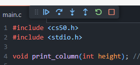

# Computer Science Harvard Course (Python)
https://cs50.harvard.edu/x/2025/

manual CS50 - C Language
https://manual.cs50.io/

profesor:
David J. Malan
malan@harvard.edu

## Listado

[Semana 1](#semana1)

1 - [Usando variables en un printf()](#printfVariables)

2 - [Carácteres de escape](#escapecharacters)

4 - [Especificadores de formato](#especificadoresdeformato)

5 - [Tipos de datos](#tipodedatos)

6 - [Condicionales](#condicionales)

7 - [Variables](#variables)

[Semana 2](#semana2)

1 - [Instalando Clang para compilar código c/c++](#clanginstall)

---

- bits and bytes -
a character in compurter world is defined within a combination of zeroes and ones.
knowing this, with 8 *bits*, you can define 256 (2^8 = 256) different characters.
a *byte* is defined as 8 *bits*.
this combination of 256 characters, gave birth to ASCII code.
Later, with more bytes available, UNICODE was created, wich can map up to
1,111,998 characters:
17 planes × 65,536 characters per plane - 2048 surrogates - 66 noncharacters.


<a id="semana1"></a>

## Semana 1 - Progarmando en C

### Command Line Interface basic commands

* `cd`, for changing our current directory (folder)
* `cp`, for copying files and directories
* `ls`, for listing files in a directory
* `mkdir`, for making a directory
* `mv`, for moving (renaming) files and directories
* `rm`, for removing (deleting) files
* `rmdir`, for removing (deleting) directories
* `code [archivo1.ext]`, creates the file and opens it to edit on VSC.

C specific commands for Visual Studio Code.
* `code [archivo2.c]`, creates a C language file to write commands in it.
* `make [archivo2]`,  compiles the file "archivo2.c" to be able to excecute it by the command line.
* `./archivo2`, executes the file "archivo2.c" compiled.

### C file structure.

```
#include <stdio.h>

int main(void)
{
    printf("hello, world\n");
}
```

>A tener en cuenta!==>

#include <stdio.h> esta linea incluye las funciones del módulo "Standard in and out" llamado  *stdio.h*  , que normalmente viene en el lenguaje C.

>The statement at the start of the code #include <stdio.h> is a very special command that tells the compile that you want to use the capabilities of a library called stdio.h, a header file. This allows you, among many other things, to utilize the printf function.
A library is a collection of code created by someone. Libraries are collections of pre-written code and functions that others have written in the past that we can utilize in our code.
You can read about all the capabilities of this library on the [Manual Pages](https://manual.cs50.io/). The Manual Pages provide a means by which to better understand what various commands do and how they function.
It turns out that CS50 has its own library called cs50.h. There are numerous functions that are included that provide training wheels while you get started in C:

`int main (void) { //... }` define la función principal que se ejecutará al usar el script:
* int indica que la función, debería "retornar" un valor *INTEGER* (int)
* main es el nombre de la función principal.
* (void) indica que la función no recibe parámetros, por lo tanto, es "vacía".

`printf("hello, world\n");`
* printf es una función que muestra en consola lo que hay dentro de los paréntesis.(el texto VA SI O SI ENTRE COMILLAS DOBLES, NO SIMPLES!!!!)
* \n genera que luego del mensaje, se realice un "salto de linea" para seguir imprimiendo o posicionar el prompt ahi.

> :warning EL PUNTO Y COMA SON MUY IMPORTANTES EN LAS DECLARACIONES EN EL LENGUAJE C!!!

<a id="escapecharacters"></a>
### Escape characters

Muchas veces vamos a querer "imprimir en pantalla" caracteres especiales, como:
"", `, \\\

Para eso tenemos el carácter de "escape" \ (barra invertida).

`\n`  create a new line

`\r`  return to the start of a line

`\"`  print a double quote

` \` `  print a single quote

`\\`  print a backslash

>CS50 functions:

`get_char` , solicita el usuario ingrese un único carácter.

`get_double` , 

`get_float` , solicita el ingreso de un nro con coma flotante(decimal).

`get_int` , solicita el ingreso de un número entero de 32bits máximo.

`get_long` , solicita el ingreso de un número de 64bits máximo.

`get_string` , solicita el ingreso de una cadena de texto.

<a id="printfVariables"></a>
### Usando variables dentro de un printf.

```
#include <cs50.h>
#include <stdio.h>

int main(void)
{
    string answer = get_string("What's your name? ");
    printf("hello, %s\n", answer);
}
```

* aqui se agrega en `#include <cs50.h>` la librería de comandos creada por el curso CS50 para su implementación más simple.

* The `get_string` function is used to get a string from the user. Then, the variable answer is passed to the printf function. %s tells the printf function to prepare itself to receive a string.

* the variable answer is string type, so to use it at `printf(" ")`, you should use the correct placeholder `%s`, and then, separated, pass the variable `answer` as a second argument.


<a id="especificadoresdeformato"></a>
#### FORMAT SPECIFIERS

* %d or %i	|_________ int	
* %f or %F	|_________ float	
* %lf	    |_________ double	
* %c	    |_________ char	
* %s        |_________ string
* %li       |_________ long


<a id="tipodedatos"></a>
### Tipos de datos.

Como C es un lenguaje de tipado fuerte, debemos declarar el tipo de datos que vamos a guardar en las variables, cuando las instanciamos.
Para eso, tenemos una lista de tipos disponibles, según los datos a guardar...

>bool ==> true / false

>char ==> 'A' / 1 / '*'  (takes up to 1 byte of data, no more) **VA SIEMPRE ENTRE COMILLAS SIMPLES!!!**

**datazo:** el motivo técnico por el cual un carácter va entre una única comilla, y un string va entre dos, es porque al alojar los bytes necesarios en memoria de un carácter, el sistema "interpreta" con comillas simples, que debe alojar un UNICO carácter, ocupando un byte unicamente.
    Cuando alojamos un string de carácteres, estamos alojando técnicamente un array de carácteres(carácteres contiguos en memoria), podemos tener 2 o más bytes por lo tanto, el sistema utiliza una manera de "delimitar" hasta donde corresponde ese array, ubicando un \0 al final del array. E interpreta que debe hacer esto, cuando usamos las comillas dobles.


>float ==> 3.14156  (works with 32 bits of data worth, so we have a 2^31 possibilites for positive and 2^32 negatives)

>double ==> 3.14157652111323 (wotks with 64 bits of data worth,kinda like float but with double of digits after comma)

>int ==> 23520

>long ==> 35.130.520.122

>string ==> "Ernest" / "Daniel" / "Library".

> VOID its a special type (not data type, you cant create a variable type void) that means null or empty.


<a id="condicionales"></a>
### Condicionales (IF /WHILE /DO WHILE /FOR IN /SWITCH)

EN C se pueden evaluar condiciones, y según la veracidad o no de estas, ejecutar cierto código. A esto se lo llama '*condicionales*'.

> Condicional IF 

*IF (condicion es verdadera)*

*{*

    //se ejecuta esto

*} ELSE* 

{

    //si la condicion no es verdadera, se ejecuta esto  

}


---

EJEMPLOS:

```
if (x < y)
{
    printf("x is less than y\n");
}
else
{
    printf("x is not less than y\n");
}
```

* Condicional con 3 posibilidades (se establece otro if con la condición en el primer ELSE)

```
if (x < y)
{
    printf("x is less than y\n");
}
else if (x > y)
{
    printf("x is greater than y\n");
}
else
{
    printf("x is equal to y\n");
}
```

---

> Condicional WHILE

* Este loop se ejecuta no importa la cantidad de veces siempre y cuando la condición establecida sea verdadera. Dada la estructura, PUEDE NO EJECUTARSE en absoluto.

*WHILE (condición)*

*{*

    //haz esto

    IMPORTANTE:dentro del bloque debería haber un contrlador que haga variar en algún momento la condición que se evalúa.

*}*


---

> Condicional DO WHILE

* Este condicional es similar al WHILE, con la diferencia de que se ejecutará el código dentro del bloque SI O SI una vez, y luego se evaluará la condición establecida.

*DO*

*{*

    //bloque de código a ejecutar.

*} WHILE (condición)*

---

> Condicional Switch

* Este condicional sirve cuando tenemos una limitada cantidad de casos posibles que queremos manejar, y posiblemente no manejar otra cantidad de posibilidades, con una excepción.


**switch (condicion)**

**{**

   **case a:**
      
      //bloque a ejecutar
      break;
  
   **case b:**
      
      //bloque a ejecutar
      break;
  
   **case c:**
      
      //bloque a ejecutar
      break;
  
   **default:**
      
    //bloque por defecto, cuando la condición es igual a un valor no anticipado

**}**


> Condicional ternario

* Este condicional es un if más directo, que devuelve automáticamente valores.

```
(condicion) ? //ejecutar si verdadero : ejecutar si falso ;
```

ó

```
int x = (condicion)
    ? ejec. si verdadero
    : ejec. si falso ;
```


---

<a id="variables"></a>
### Variables


En C, al declarar las variables, debemos indicar qué tipo de dato almacenarán. Esto genera que haya menos error en ejecución, pero generará que el código no compile correctamente si hay un destrato de los datos y sus tipos.

* Podemos declarar una variable de la siguiente manera

`int contador = 0;`

>Esto significa que el tipo de dato guardado en la variable será INTeger, que el nombre de la variable será *contador*, y que el valor al inicializarla será 0.


---

### Truncation

**Truncation** es el resultado cuando obtenemos un valor no contemplado al manejar las variables y resultados.

Normalmente podemos querer manejar valores que como resultado de una función, dan un tipo de valor distinto. 
Ej:

```
int x = 5;

int y = 2;

printf("%i", x / y);
```

esto en principio, debería mostrar en consola el resultado de dividir 5 por 2, pero sabemos que el resultado es un número real con coma flotante, por lo tanto, sería 2.5.
El problema viene que estamos tratando el resultado como un int, (por eso el %i en la función printf()) por lo tanto, esto nos mostrará por pantalla solamente el número entero antes de la coma, en este caso 2.

Para resolver esto, podemos inicialmente cambiar el tipo de datos que estamos recibiendo o inicializando, de la siguiente manera..

```
*float x = 5;*

*float y = 2;*

*printf( "%f", x / y);*
```

> Esto resuelve algunos de nuestros problemas con respecto a los resultados a mostrar y manejar, sin embargo, sabiendo que los números con coma suelen poder tener una gran cantidad de dígitos o incluso infinita, y la limitación por bytes para representar un número, se plantea que en computación existe una **Imprecisión de coma flotante** debido a la imposibilidad de representar fielmente dichos nros.

Otra manera que tenemos de manejar nuestros resultados es la siguiente:
```
int x = 5;

int y = 2;

printf(" %.2f ", (float) x / y);
```

`%.2f` esto significa que tenemos un placeholder de un valor %f (float), pero que aparte, queremos representar 2 dígitos luego de la coma solamente (.2). Esto nos permite tener un mayor control sobre qué resultado se mostrará.

`(float x / y)` ingresar entre paréntesis un nuevo tipo de datos, permite "cambiarlo al vuelo" tratando el resultado de x/y como un valor float, para que coincida con la representación en la función printf(). 

#### Command line in unix systems.

* Comandos a tener en cuenta en una terminal basada en unix. Normalmente esto no funciona en la linea de comandos de Windows.

- ls   { lista el directorio activo }

- cd [nombre_del_directorio] { entrar a un directorio especificador }

- pwd { indica la ruta actual donde nos encontramos }

- mkdir [nombre_de_la_carpeta] { crear una carpeta con el nombre indicado }

- cp [archivo_origen.ext] [archivo_destino.ext] { crea una copia del archivo de orígen en un nuevo archivo de nombre "archivo_destino.ext" }

- cp -r [directorio_a_copiar] [nombre_de_nuevo_directorio] { copia todo un directorio completo, a otro creado con el "nombre_de_nuevo_directorio" }

- rm (-f) [archivo_a_borrar] { borrar el archivo, el flag -f nos permite no confirmar el borrado del archivo, pero es más peligroso! }

- rm -rf [nombre_de_directorio_a_borrar] { borra el directorio y su contenido }

- mv [nombre_original_de_archivo_a_renombrar] [nombre_de_nuevo_nombre]

- chmod

- ln

- touch

- rmdir

- man

- diff

- sudo

- clear

- telnet

### The #define preprocessor directive (MACRO).

* Para no definir constantes dentro del código, ni tener nros o textos "mágicos" en el mismo, podemos usar este acercamiento para que al C compilar el código, se reemplace lo que indiquemos en las primeras lineas con #define. Esto forma parte del pre-procesado del código en C.

ej:

tenemos el código siguiente....
```
card deal_card(deck name)
 {
    for (int i=0; i > 52; i++ )
    {
        // deal the card
    }
 }
```

Podemos modificar la constante 52 de la siguiente manera...
```
#define DECKSIZE 52

card deal_card(deck name)
 {
    for (int i=0; i > DECKSIZE; i++ )
    {
        // deal the card
    }
 }

```
y esto evita que tengamos "suelto" una constante dentro del código.


`#define [variable_a_reemplazar] [valor_por_el_cual_reemplazar]`


### Mario problem 1 -

* Crear un programa que imprima una pirámide de "#" donde el usuario pueda seleccionar qué alto tendrá, y la pirámide esté alineada a la derecha, con espacios aparte de los "#".


```
#include <cs50.h>
#include <stdio.h>

void pyramid(int length);

int main(void)
{
    int filpir;

    do
    {
        filpir = get_int("ingrese la cantidad de filas de la pirámide:");
    }
    while (filpir <= 0 || filpir > 23);

    pyramid(filpir);

    printf("\n");
    printf("Solved!\n");
}

void pyramid(int length)
{
    // por cada fila, imprimimos un símbolo de acuerdo a cuantas sean la mayor cantidad
    for (int i = 0; i < length; i++) // por cada fila imprimimos
    {
        int fila = i + 1;
        for (int j = 0; j < length - fila; j++)
        {
            printf(" ");
        }
        for (int k = 0; k < fila; k++)
        {
            printf("#");
        }
        printf("\n");
    }
}
```


<a id="semana2"></a>

## Semana 2 - Programando en C

### Instalando CLang para compilar código de lenguage C / C++ y poder ejecutarlo.

* Para poder compilar códigdo de C / C++ directamente desde la linea de comandos, debemos tener instalado el programa CLang, que se utiliza para dicha tarea.

* Accedemos a la página oficial, [VVLM - Clang](https://clang.llvm.org/)
y luego buscamos la sección 
[Descargas / downloads](https://releases.llvm.org/download.html).

* Esto nos lleva a la lista de software para poder elegir la versión. 
Cada versión tiene su repositorio en github, por lo que accedemos al vínculo correspondiente a la versión, y en la lista podemos seleccionar la versión de ejecutables para descargar e instalar.  en este caso, la versión para [Winx64](https://github.com/llvm/llvm-project/releases/tag/llvmorg-18.1.6)


### Utilizando Clang para compilar código.

* Al tratar de compilar algún archivo C, CLang dará como salida un archivo de nombre `a.out` siempre.


### CLI Clang arguments (soft externo para compilar codigo en C / C++ )

clang:
* -o [nuevo_nombre_del_archivo_compilado] [nombre_original_del_archivo] 
    ej: clang -o(--output) micodigo micodigo.c

### Preprocessing, compiling, assembling, linking .- 

- El preproceso en C, implica realizar tareas antes de iniciar el procesado del código que escribimos. Esto se define con las primeras lineas del código, que llevan un símbolo hash (**#**) para identificar que estas lineas, se ejecutarán primero para copiar prototipos, definir variables dentro del código, etc.

- El Compilado sucede luego de haberse preprocesado el código, cuando ya todo está en su lugar, pero todavía en lenguaje C en este caso. El compilado es traducir el lenguaje C en **Assembly Code**.

- En tercer lugar, se realiza el ensamblado, que no es más que traducir el codigo assembly en ceros y unos, que finalmente, es lo que entiende el procesador por comandos.

- Finalmente, se realiza la vinculación, que no es más que considerar todos los archivos son necesarios dado el código que hay que ejecutar y vincularlos para ejecutar el mismo código que está escrito.

### Debugging

Para utilizar el debugger de CS50 en Visual Studio Code, que nos permite revisar el código paso a paso, e indicar puntos clave para analizar en pausa inclusive, se coloca un "breakpoint" en el código, clickeando a la izquierda de la linea en cuestión, como se ve en la imágen:


Luego, se ejecuta en la terminal el comando debug50 [nombre_del_ejecutable_C]

Esto abrira la interfaz del debugger de VSC, el cual nos permite ver las variables en el SCOPE actual, sus valores, y se detendrá en el breakpoint que marcamos.

aqui nos presentará con botones en la parte superior del codigo:



- Los botones corresponden a las siguientes acciones:

 : Este botón deja correr el código de manera normal.

 : este botón nos permite ir linea a linea en el código.

 : este botón nos permite, entrar en la función que estamos enfocando en el código principal ,y analizarla paso a paso.

 : Al contrario de la anterior, este botón nos permite "salir" de la función que estemos analizando internamente.

 : Nos permite reiniciar la ejeción del código.

 : finaliza la ejecución del código de una vez.

---

### Estructuras de datos

ARRAYS

* Para crear un array que es un conjunto de elementos del mismo tipo que se distribuyen juntos, se utiliza la siguiente sintaxis:

`tipo nombre[cantidad_de_elementos_a_guardar]`

ej:
`int scores[3]`

esto define un array de 3 posiciones, que guardará elementos de tipo INT.

* Para acceder a dichas posiciones y guardar o leer datos, lo hacemos de la siguiente manera:

scores[0] = 72;
scores[1] = 73;
scores[2] = 33;

Cuando tenemos una función y debemos pasarle un array, se le debe pasar como parámetros, el nombre del array con los corchetes vacíos, indicándo que no sabemos qué longitud tiene, pero **SI DEBEMOS PASARLE** la longitud como 2do parámetro.

- En este caso, el array es notas[], tiene una longitud de tamaño "largo". Son los únicos 2 parámetros que se pasan.

ej:
```
float promedio(int largo, int notas[])
{
    float suma = 0;
    for (int i = 0; i < largo; i++)
    {
        suma += notas[i];
    }
    float prom = suma / largo;
    return prom;
}
```


> STRING ARRAY (Caso particular)

* Las variables definidas como *STRING* son casos particulares de arrays, dado que son bytes guardados uno consecuente al otro, juntos en memoria, como un array de cualquier tipo de datos.
Normalmente, siendo un array, podemos acceder a sus datos con la notación habitual, pero la longitud, es 1 byte mayor al texto siempre, dado que la pc utiliza ese byte extra para indicar la finalización del *array string* llenándolo con 0's.

- ej:

```
#include <cs50.h>
#include <stdio.h>

int main(void)
{//printing a word in a string, as an array of characters.
    string s = "Hello!";
    printf("%c%c%c%c%c%c\n", s[0], s[1], s[2], s[3], s[4], s[5]);
    printf("----------------------------------\n");
    printf("the same array, but interpreting each character as an integer, as ASCII code\n");
    //put an extra interpreter and array index to see the 0 at the end of the string...:
    printf("%i %i %i %i %i %i %i\n", s[0], s[1], s[2], s[3], s[4], s[5], s[6]);
}
```


---


### Modificando la función principal Main

* Hasta el momento hemos definido siempre la función principal llamada main con un parámetro llamado *void*, que implica que la función no toma argumentos en su ejecución, pero resulta que esto se puede modificar, para que al ejecutar la misma desde la linea de comandos, los "flags" o "argumentos" se puedan utilizar en la función misma.

Estos argumentos, se toman como un array de strings, por lo tanto, como se debe hacer en C, debemos pasar una variable con la cantidad de argumentos(longitud), y el array de argumentos en sí.
```
int main(int argc, string argv[]){}
```

**argc** representa "argument quantity", y **argv** representa "argument vector".

- ej: cuando ejecutamos un programa, aparte del nombre del mismo, podemos proveer argumentos que "cambian" la ejecución del mismo.

c:> programaEnC.exe nuevo david 3500

> al ejecutar una linea de este estilo, estamos pasando todo lo separado con espacios como argumento.
En este caso, el array quedaría:
["programaEnC", "nuevo", "david", 3500]
y con el string argv[] podemos acceder a ellos de manera eficaz.

---

### Statuses 

* Cando definimos la función main, normalmente le asignamos int al valor que debería retornar la misma. Cuando el software termina, nos da un nro al "salir" del programa, ya sea por error o por haber realizado la tarea para la cual se creó.


---

### Scrabble problem 1 -