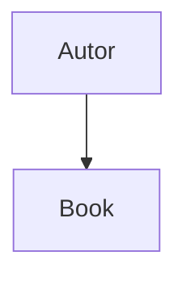
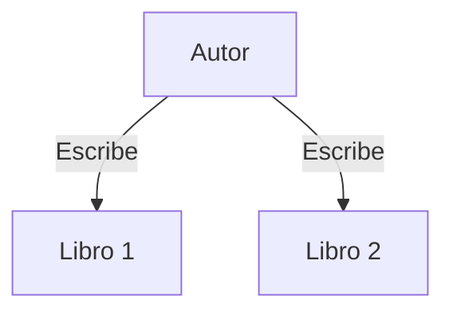
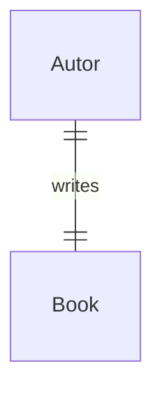

## Relaciones entre tablas y datos
Relaciones uno a uno

Supongamos que teniendo una tabla de libros, con el dato de autor, podriamos pensar que un autor, escribe solo y solo un libro.



Pero esta no es una posibilidad en el mundo actual. Teniendo en cuenta esto, podríamos entonces decir que un autor, puede escribir más de un libro...



Pero esto tampoco es verdad, en el mundo tenemos un montón de autores que escriben muchos libros, y un libro puede ser escrito por muchos autores!

Asi definimos que podemos tener relaciones de
- Uno a uno
- Uno a muchos
- Muchos a muchos

usando la notación de la pata de cuervo (crow's foot notation) podemos representar la primer idea que tuvimos de la siguiente manera...

UN AUTOR PUEDE ESCRIBIR UN LIBRO Y 
UN LIBRO PUEDE SER ESCRITO POR UN AUTOR



Pero vamos a extender la idea de que un autor puede escribir varios libros y un libro puede ser escritos por muchos autores.


Este gráfico se lee, "Un autor puede escribir uno o más libros" y "un libro puede tener uno o más autores".

---

## Primary Key

Una primary key es un identificador único que inequívocamente identificar a uno y solo uno de los registros que tenemos en nuestra tabla.
En el caso de los libros, un identificador único podría ser el ISBN, que es el identificador único por defecto de libros, no lo inventamos para el ejemplo.

En nuestro caso, tendríamos entonces, una tabla con una columna de título de libro, y otra llamada ISBN justamente para identificar cada libro inequívocamente.

## Foreign key

Una *foreign key* es justamente, una primary key de una tabla, insertada o usada en otra tabla, para relacionar los registros. Esto implica que una tabla con FK debe ser creada luego de crear la tabla que implementa la PK usada.

Estos dos conceptos nos ayudan a manejar las relaciones muchos a muchos, dado que es una que normalmente genera repeticiones en registros si no se manejan correctamente.

Dada la relación, usamos las PK de cada tabla, para crear una tabla intermedia con esas dos FK, una representando al elemento 1, y otra representando al elemento 2. En nuestro caso, la tabla de libros tiene una pk para cada libro, y la tabla de autores, tiene otra pk para cada autor. 

## Subqueries

Las subqueries nos ayudan cuando necesitamos realizar o encontrar datos entre dos o más tablas.
Si tuvieramos una tabla con los publicadores de libros y sus ids, y usaramos otra tabla para los títulos de los libros y una FK con el id del publicador, tendríamos dos tablas, relacionadas entre si.

Supongamos ahora que queremos saber qué libros fueron publicados por un publicador x. En principio, deberíamos
- Consultar la tabla publicadores, para obtener la id del publicador x que queremos saber.
- Consultar la tabla libros, para obtener los libros que estan relacionados con la id del publicador que obtuvimos en el primer paso.

EJEMPLO
```sql
SELECT "titulo" FROM "libros"
WHERE "id_publicador" = (
	SELECT "id" FROM "publicadores"
	WHERE "nombrePublicador" = "MiPublicadorPreferido"
)
```

Notemos que estamos realizando 2 queries. Una para retornar el *id* del *publicador*, que luego usamos en la principal al buscar los libros publicados por esa publicadora de *id_publicador*.

Primero se ejectura la query dentro de paréntesis, y luego sigue la externa, con el valor retornado.

Las *subqueries* se pueden utilizar para filtrar datos en *dos tablas* de relación *muchos a muchos*

